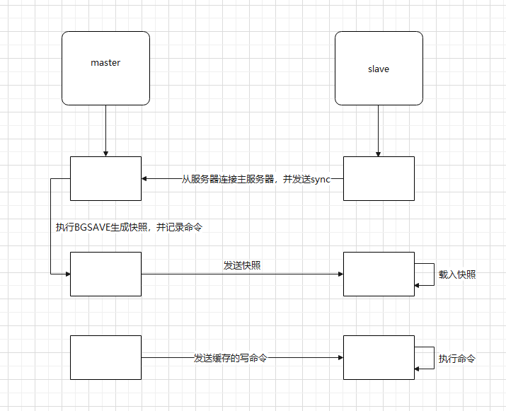

# 搭建Redis

## 安装

```shell
# 使用压缩包安装，或者使用yum直接安装（但是yum上版本很低）
# yum安装
yum search redis
yum install -y redis
# 压缩包安装
tar -zxvf 安装包包名
#用yum安装gcc-c++、make
yum install -y gcc-c++ make
#make安装
make && make install
```

## 开启Redis

```shell
#开启Redis有两种方法
方法一：
[root@master redis-6.2.6]# cd src/
[root@master src]# ./redis-server     # redis打开一个配置文件就相当于开启一个redis服务
7885:C 22 Mar 2022 21:49:08.111 # oO0OoO0OoO0Oo Redis is starting oO0OoO0OoO0Oo
7885:C 22 Mar 2022 21:49:08.111 # Redis version=6.2.6, bits=64, commit=00000000, modified=0, pid=7885, just started
7885:C 22 Mar 2022 21:49:08.111 # Warning: no config file specified, using the default config. In order to specify a config file use ./redis-server /path/to/redis.conf
7885:M 22 Mar 2022 21:49:08.111 * Increased maximum number of open files to 10032 (it was originally set to 1024).
7885:M 22 Mar 2022 21:49:08.111 * monotonic clock: POSIX clock_gettime
                _._                                                  
           _.-``__ ''-._                                             
      _.-``    `.  `_.  ''-._           Redis 6.2.6 (00000000/0) 64 bit
  .-`` .-```.  ```\/    _.,_ ''-._                                  
 (    '      ,       .-`  | `,    )     Running in standalone mode
 |`-._`-...-` __...-.``-._|'` _.-'|     Port: 6379
 |    `-._   `._    /     _.-'    |     PID: 7885
  `-._    `-._  `-./  _.-'    _.-'                                   
 |`-._`-._    `-.__.-'    _.-'_.-'|                                  
 |    `-._`-._        _.-'_.-'    |           https://redis.io       
  `-._    `-._`-.__.-'_.-'    _.-'                                   
 |`-._`-._    `-.__.-'    _.-'_.-'|                                  
 |    `-._`-._        _.-'_.-'    |                                  
  `-._    `-._`-.__.-'_.-'    _.-'                                   
      `-._    `-.__.-'    _.-'                                       
          `-._        _.-'                                           
              `-.__.-'                                               

7885:M 22 Mar 2022 21:49:08.112 # WARNING: The TCP backlog setting of 511 cannot be enforced because /proc/sys/net/core/somaxconn is set to the lower value of 128.
7885:M 22 Mar 2022 21:49:08.112 # Server initialized
7885:M 22 Mar 2022 21:49:08.112 # WARNING overcommit_memory is set to 0! Background save may fail under low memory condition. To fix this issue add 'vm.overcommit_memory = 1' to /etc/sysctl.conf and then reboot or run the command 'sysctl vm.overcommit_memory=1' for this to take effect.
7885:M 22 Mar 2022 21:49:08.112 * Loading RDB produced by version 6.2.6
7885:M 22 Mar 2022 21:49:08.112 * RDB age 71 seconds
7885:M 22 Mar 2022 21:49:08.112 * RDB memory usage when created 0.77 Mb
7885:M 22 Mar 2022 21:49:08.112 # Done loading RDB, keys loaded: 0, keys expired: 0.
7885:M 22 Mar 2022 21:49:08.112 * DB ed from disk: 0.000 seconds
7885:M 22 Mar 2022 21:49:08.112 * Ready to accept connections
方法二：
[root@ws opt]# redis-server redis.conf 
[root@ws opt]# ps -ef | grep redis
root        1652       1  0 12:32 ?        00:00:01 redis-server 127.0.0.1:6379
```

## 关闭redis

~~~shell
redis-cli shu
~~~

## 连接redis

~~~shell
redis-cli -h 127.0.0.1 -p 6379
~~~

## Redis 持久化RDB和AOF

### 1、RDB

RDB 是 Redis 默认的持久化方案。在指定的时间间隔内，执行指定次数的写操作，则会将内存中的数据写入到磁盘中。即在指定目录下生成一个dump.rdb文件。Redis 重启会通过加载dump.rdb文件恢复数据。

### （1）RDB详解

#### ① 从配置文件了解RDB

打开 redis.conf 文件，找到 SNAPSHOTTING 对应内容
1 RDB核心规则配置（重点）

```shell
save <seconds> <changes>
# save ""
save 900 1
save 300 10
save 60 10000
```
解说：save <指定时间间隔> <执行指定次数更新操作>，满足条件就将内存中的数据同步到硬盘中。官方出厂配置默认是 900秒内有1个更改，300秒内有10个更改以及60秒内有10000个更改，则将内存中的数据快照写入磁盘。
若不想用RDB方案，可以把 save “” 的注释打开，下面三个注释。

2 指定本地数据库文件名，一般采用默认的 dump.rdb

```shell
dbfilename dump.rdb
```

3 指定本地数据库存放目录，一般也用默认配置

```shell
dir ./
```

4 默认开启数据压缩

```shell
rdbcompression yes
```

解说：配置存储至本地数据库时是否压缩数据，默认为yes。Redis采用LZF压缩方式，但占用了一点CPU的时间。若关闭该选项，但会导致数据库文件变的巨大。建议开启。

#### ② 触发RDB快照

1 在指定的时间间隔内，执行指定次数的写操作
2 执行save（阻塞， 只管保存快照，其他的等待） 或者是bgsave （异步）命令
3 执行flushall 命令，清空数据库所有数据，意义不大。
4 执行shutdown 命令，保证服务器正常关闭且不丢失任何数据，意义也不大。

#### ③ 通过RDB文件恢复数据

将dump.rdb 文件拷贝到redis的安装目录的bin目录下，重启redis服务即可。在实际开发中，一般会考虑到物理机硬盘损坏情况，选择备份dump.rdb 。可以从下面的操作演示中可以体会到。

### （2）RDB 的优缺点

优点：
1 适合大规模的数据恢复。
2 如果业务对数据完整性和一致性要求不高，RDB是很好的选择。

缺点：
1 数据的完整性和一致性不高，因为RDB可能在最后一次备份时宕机了。
2 备份时占用内存，因为Redis 在备份时会独立创建一个子进程，将数据写入到一个临时文件（此时内存中的数据是原来的两倍哦），最后再将临时文件替换之前的备份文件。
所以Redis 的持久化和数据的恢复要选择在夜深人静的时候执行是比较合理的。

### （3）操作演示

```shell
[root@itdragon bin]# vim redis.conf
save 900 1
save 120 5
save 60 10000
[root@itdragon bin]# ./redis-server redis.conf
[root@itdragon bin]# ./redis-cli -h 127.0.0.1 -p 6379
127.0.0.1:6379> keys *
(empty list or set)
127.0.0.1:6379> set key1 value1
OK
127.0.0.1:6379> set key2 value2
OK
127.0.0.1:6379> set key3 value3
OK
127.0.0.1:6379> set key4 value4
OK
127.0.0.1:6379> set key5 value5
OK
127.0.0.1:6379> set key6 value6
OK
127.0.0.1:6379> SHUTDOWN
not connected> QUIT
[root@itdragon bin]# cp dump.rdb dump_bk.rdb
[root@itdragon bin]# ./redis-server redis.conf
[root@itdragon bin]# ./redis-cli -h 127.0.0.1 -p 6379
127.0.0.1:6379> FLUSHALL 
OK
127.0.0.1:6379> keys *
(empty list or set)
127.0.0.1:6379> SHUTDOWN
not connected> QUIT
[root@itdragon bin]# cp dump_bk.rdb  dump.rdb
cp: overwrite `dump.rdb'? y
[root@itdragon bin]# ./redis-server redis.conf
[root@itdragon bin]# ./redis-cli -h 127.0.0.1 -p 6379
127.0.0.1:6379> keys *
1) "key5"
2) "key1"
3) "key3"
4) "key4"
5) "key6"
6) "key2"
```

第一步：vim 修改持久化配置时间，120秒内修改5次则持久化一次。
第二步：重启服务使配置生效。
第三步：分别set 5个key，过两分钟后，在bin的当前目录下会自动生产一个dump.rdb文件。（set key6 是为了验证shutdown有触发RDB快照的作用）
第四步：将当前的dump.rdb 备份一份（模拟线上工作）。
第五步：执行FLUSHALL命令清空数据库数据（模拟数据丢失）。
第六步：重启Redis服务，恢复数据。数据是空的？这是因为FLUSHALL也有触发RDB快照的功能。
第七步：将备份的 dump_bk.rdb 替换 dump.rdb 然后重新Redis。

### 2、AOF

### （1）AOF详解

AOF ：Redis 默认不开启。它的出现是为了弥补RDB的不足（数据的不一致性），所以它采用日志的形式来记录每个**写操作**，并**追加**到文件中。Redis 重启的会根据日志文件的内容将写指令从前到后执行一次以完成数据的恢复工作。

#### ① 从配置文件了解AOF

打开 redis.conf 文件，找到 APPEND ONLY MODE 对应内容
1 redis 默认关闭，开启需要手动把no改为yes

```shell
appendonly yes
```

2 指定本地数据库文件名，默认值为 appendonly.aof

```shell
appendfilename "appendonly.aof"
```

3 指定更新日志条件

```shell
# appendfsync always
appendfsync everysec
# appendfsync no
```

解说：
always：同步持久化，每次发生数据变化会立刻写入到磁盘中。性能较差当数据完整性比较好（慢，安全）
everysec：出厂默认推荐，每秒异步记录一次（默认值）
no：不同步

4 配置重写触发机制

```shell
auto-aof-rewrite-percentage 100
auto-aof-rewrite-min-size 64mb
```

解说：当AOF文件大小是上次rewrite后大小的一倍且文件大于64M时触发。一般都设置为3G，64M太小了。

#### ② 触发AOF快照

根据配置文件触发，可以是每次执行触发，可以是每秒触发，可以不同步。

#### ③ 根据AOF文件恢复数据

正常情况下，将appendonly.aof 文件拷贝到redis的安装目录的bin目录下，重启redis服务即可。但在实际开发中，可能因为某些原因导致appendonly.aof 文件格式异常，从而导致数据还原失败，可以通过命令redis-check-aof --fix appendonly.aof 进行修复 。从下面的操作演示中体会。

#### ④ AOF的重写机制

前面也说到了，AOF的工作原理是将写操作追加到文件中，文件的冗余内容会越来越多。所以聪明的 Redis 新增了重写机制。当AOF文件的大小超过所设定的阈值时，Redis就会对AOF文件的内容压缩。

重写的原理：Redis 会fork出一条新进程，读取内存中的数据，并重新写到一个临时文件中。并没有读取旧文件（你都那么大了，我还去读你？？？ o(ﾟДﾟ)っ傻啊！）。最后替换旧的aof文件。

触发机制：当AOF文件大小是上次rewrite后大小的一倍且文件大于64M时触发。这里的“一倍”和“64M” 可以通过配置文件修改。

### （2）AOF 的优缺点

优点：数据的完整性和一致性更高
缺点：因为AOF记录的内容多，文件会越来越大，数据恢复也会越来越慢。

### （3）操作演示

```shell
[root@itdragon bin]# vim appendonly.aof
appendonly yes
[root@itdragon bin]# ./redis-server redis.conf
[root@itdragon bin]# ./redis-cli -h 127.0.0.1 -p 6379
127.0.0.1:6379> keys *
(empty list or set)
127.0.0.1:6379> set keyAOf valueAof
OK
127.0.0.1:6379> FLUSHALL 
OK
127.0.0.1:6379> SHUTDOWN
not connected> QUIT
[root@itdragon bin]# ./redis-server redis.conf
[root@itdragon bin]# ./redis-cli -h 127.0.0.1 -p 6379
127.0.0.1:6379> keys *
1) "keyAOf"
127.0.0.1:6379> SHUTDOWN
not connected> QUIT
[root@itdragon bin]# vim appendonly.aof
fjewofjwojfoewifjowejfwf
[root@itdragon bin]# ./redis-server redis.conf
[root@itdragon bin]# ./redis-cli -h 127.0.0.1 -p 6379
Could not connect to Redis at 127.0.0.1:6379: Connection refused
not connected> QUIT
[root@itdragon bin]# redis-check-aof --fix appendonly.aof 
'x              3e: Expected prefix '*', got: '
AOF analyzed: size=92, ok_up_to=62, diff=30
This will shrink the AOF from 92 bytes, with 30 bytes, to 62 bytes
Continue? [y/N]: y
Successfully truncated AOF
[root@itdragon bin]# ./redis-server redis.conf
[root@itdragon bin]# ./redis-cli -h 127.0.0.1 -p 6379
127.0.0.1:6379> keys *
1) "keyAOf"
```

第一步：修改配置文件，开启AOF持久化配置。
第二步：重启Redis服务，并进入Redis 自带的客户端中。
第三步：保存值，然后模拟数据丢失，关闭Redis服务。
第四步：重启服务，发现数据恢复了。（额外提一点：有教程显示FLUSHALL 命令会被写入AOF文件中，导致数据恢复失败。我安装的是redis-4.0.2没有遇到这个问题）。
第五步：修改appendonly.aof，模拟文件异常情况。
第六步：重启 Redis 服务失败。这同时也说明了，RDB和AOF可以同时存在，且优先加载AOF文件。
第七步：校验appendonly.aof 文件。重启Redis 服务后正常。

补充点：aof 的校验是通过 redis-check-aof 文件，那么rdb 的校验是不是可以通过 redis-check-rdb 文件呢？？？

### 3 总结

1. Redis 默认开启RDB持久化方式，在指定的时间间隔内，执行指定次数的写操作，则将内存中的数据写入到磁盘中。
2. RDB 持久化适合大规模的数据恢复但它的数据一致性和完整性较差。
3. Redis 需要手动开启AOF持久化方式，默认是每秒将写操作日志追加到AOF文件中。
4. AOF 的数据完整性比RDB高，但记录内容多了，会影响数据恢复的效率。
5. Redis 针对 AOF文件大的问题，提供重写的瘦身机制。
6. 若只打算用Redis 做缓存，可以关闭持久化。
7. 若打算使用Redis 的持久化。建议RDB和AOF都开启。其实RDB更适合做数据的备份。AOF出问题了，还有RDB。

## 主从群集

和Mysql主从复制的原因一样，Redis虽然读取写入的速度都特别快，但是也会产生读压力特别大的情况。为了分担读压力，Redis支持主从复制，Redis的主从结构可以采用一主多从或者级联结构，Redis主从复制可以根据是否是全量分为全量同步和增量同步。

### 全量同步

Redis全量复制一般发生在Slave初始化阶段，这时Slave需要将Master上的所有数据都复制一份。具体步骤如下： 

- 从服务器连接主服务器，发送SYNC命令； 
- 主服务器接收到SYNC命名后，开始执行BGSAVE命令生成RDB文件并使用缓冲区记录此后执行的所有写命令； 
- 主服务器BGSAVE执行完后，向所有从服务器发送快照文件，并在发送期间继续记录被执行的写命令； 
- 从服务器收到快照文件后丢弃所有旧数据，载入收到的快照； 
- 主服务器快照发送完毕后开始向从服务器发送缓冲区中的写命令； 
- 从服务器完成对快照的载入，开始接收命令请求，并执行来自主服务器缓冲区的写命令；



完成上面几个步骤后就完成了从服务器数据初始化的所有操作，从服务器此时可以接收来自用户的读请求。

### 增量同步

**增量同步**

Redis增量复制是指Slave初始化后开始正常工作时主服务器发生的写操作同步到从服务器的过程。 

增量复制的过程主要是主服务器每执行一个写命令就会向从服务器发送相同的写命令，从服务器接收并执行收到的写命令。

### RDB模式

修改配置文件将其中的持久化改为默认的RDB模式，AOF模式关闭

为什么要关闭AOF？

因为主节点要把内存中的一切数据要传给从节点，这中是RDB的原理，主节点执行bgsave，生成RDB，一旦生成，就会发送从节点。

```shell
#开启RDB 默认就是开启的
#save ""
save 3600 1
save 300 100
save 60 10000

#关闭AOF
appendonly no
```

如果要用一台虚拟机做测试

就要修改每个实例的声明ip地址

```shell
replica-announce-ip 10.10.70.101
```

### 开启Redis

```shell
#未开启后台运行模式
[root@master src]# pwd
/root/redis-6.2.6/src
[root@master src]# ./redis-server 
8639:C 22 Mar 2022 23:13:52.950 # oO0OoO0OoO0Oo Redis is starting oO0OoO0OoO0Oo
8639:C 22 Mar 2022 23:13:52.950 # Redis version=6.2.6, bits=64, commit=00000000, modified=0, pid=8639, just started
8639:C 22 Mar 2022 23:13:52.950 # Warning: no config file specified, using the default config. In order to specify a config file use ./redis-server /path/to/redis.conf
8639:M 22 Mar 2022 23:13:52.950 * Increased maximum number of open files to 10032 (it was originally set to 1024).
8639:M 22 Mar 2022 23:13:52.950 * monotonic clock: POSIX clock_gettime
                _._                                                  
           _.-``__ ''-._                                             
      _.-``    `.  `_.  ''-._           Redis 6.2.6 (00000000/0) 64 bit
  .-`` .-```.  ```\/    _.,_ ''-._                                  
 (    '      ,       .-`  | `,    )     Running in standalone mode
 |`-._`-...-` __...-.``-._|'` _.-'|     Port: 6379
 |    `-._   `._    /     _.-'    |     PID: 8639
  `-._    `-._  `-./  _.-'    _.-'                                   
 |`-._`-._    `-.__.-'    _.-'_.-'|                                  
 |    `-._`-._        _.-'_.-'    |           https://redis.io       
  `-._    `-._`-.__.-'_.-'    _.-'                                   
 |`-._`-._    `-.__.-'    _.-'_.-'|                                  
 |    `-._`-._        _.-'_.-'    |                                  
  `-._    `-._`-.__.-'_.-'    _.-'                                   
      `-._    `-.__.-'    _.-'                                       
          `-._        _.-'                                           
              `-.__.-'                                               

8639:M 22 Mar 2022 23:13:52.952 # WARNING: The TCP backlog setting of 511 cannot be enforced because /proc/sys/net/core/somaxconn is set to the lower value of 128.
8639:M 22 Mar 2022 23:13:52.952 # Server initialized
8639:M 22 Mar 2022 23:13:52.952 # WARNING overcommit_memory is set to 0! Background save may fail under low memory condition. To fix this issue add 'vm.overcommit_memory = 1' to /etc/sysctl.conf and then reboot or run the command 'sysctl vm.overcommit_memory=1' for this to take effect.
8639:M 22 Mar 2022 23:13:52.952 * Ready to accept connections
#开启后台运行
[root@master src]# ./redis-server 
6961:C 23 Mar 2022 03:18:14.214 # oO0OoO0OoO0Oo Redis is starting oO0OoO0OoO0Oo
6961:C 23 Mar 2022 03:18:14.214 # Redis version=6.2.6, bits=64, commit=00000000, modified=0, pid=6961, just started
6961:C 23 Mar 2022 03:18:14.214 # Warning: no config file specified, using the default config. In order to specify a config file use ./redis-server /path/to/redis.conf
6961:M 23 Mar 2022 03:18:14.214 * Increased maximum number of open files to 10032 (it was originally set to 1024).
6961:M 23 Mar 2022 03:18:14.214 * monotonic clock: POSIX clock_gettime
6961:M 23 Mar 2022 03:18:14.215 # Warning: Could not create server TCP listening socket *:6379: bind: Address already in use
6961:M 23 Mar 2022 03:18:14.215 # Failed listening on port 6379 (TCP), aborting.
```

### 主从同步命令

只需要配置从服务器就可以

配置主从可以使用replicaof或者slaveof（5.0以前）命令。#这两个命令效果一样

有临时和永久操作：

#### 修改配置文件（永久生效）

在redis.conf中添加一行配置  

```
replicaof <host> <port>
```

#### 临时失效

使用redis-cli客户端连接到redis服务，执行slaveof命令

```
replicaof <host> <port>
```

首先看一下redis.conf 配置文件中的各个参数，详解如下

```shell
# redis进程是否以守护进程的方式运行，yes为是，no为否(不以守护进程的方式运行会占用一个终端)。
daemonize no
# 指定redis进程的PID文件存放位置
pidfile /var/run/redis.pid
# redis进程的端口号
port 6379
# 是否开启保护模式，默认开启。要是配置里没有指定bind和密码。开启该参数后，redis只会本地进行访问，拒绝外部访问。要是开启了密码和bind必须指定。建议：可以开启。否则最好关闭设置为no。
protected-mode yes
# 绑定的主机地址
bind 127.0.0.1
# 客户端闲置多长时间后关闭连接，默认此参数为0即关闭此功能
timeout 300
# redis日志级别，可用的级别有debug.verbose.notice.warning
loglevel verbose
# log文件输出位置，如果进程以守护进程的方式运行，此处又将输出文件设置为stdout的话，就会将日志信息输出到/dev/null里面去了
logfile stdout
# 设置数据库的数量，默认为0可以使用select <dbid>命令在连接上指定数据库id
databases 16
# 指定在多少时间内刷新次数达到多少的时候会将数据同步到数据文件
save <seconds> <changes>
# 指定存储至本地数据库时是否压缩文件，默认为yes即启用存储
rdbcompression yes
# 指定本地数据库文件名
dbfilename dump.db
# 指定本地数据问就按存放位置
dir ./
# 指定当本机为slave服务时，设置master服务的IP地址及端口，在redis启动的时候他会自动跟master进行数据同步
replicaof <masterip> <masterport>
# 当master设置了密码保护时，slave服务连接master的密码
masterauth <master-password>
# 设置redis连接密码，如果配置了连接密码，客户端在连接redis是需要通过AUTH<password>命令提供密码，默认关闭
requirepass footbared
# 设置同一时间最大客户连接数，默认无限制。redis可以同时连接的客户端数为redis程序可以打开的最大文件描述符，如果设置 maxclients 0，表示不作限制。当客户端连接数到达限制时，Redis会关闭新的连接并向客户端返回 max number of clients reached 错误信息
maxclients 128
# 指定Redis最大内存限制，Redis在启动时会把数据加载到内存中，达到最大内存后，Redis会先尝试清除已到期或即将到期的Key。当此方法处理后，仍然到达最大内存设置，将无法再进行写入操作，但仍然可以进行读取操作。Redis新的vm机制，会把Key存放内存，Value会存放在swap区
maxmemory<bytes>
# 指定是否在每次更新操作后进行日志记录，Redis在默认情况下是异步的把数据写入磁盘，如果不开启，可能会在断电时导致一段时间内的数据丢失。因为redis本身同步数据文件是按上面save条件来同步的，所以有的数据会在一段时间内只存在于内存中。默认为no。
appendonly no
# 指定跟新日志文件名默认为appendonly.aof
appendfilename appendonly.aof
# 指定更新日志的条件，有三个可选参数 - no：表示等操作系统进行数据缓存同步到磁盘(快)，always：表示每次更新操作后手动调用fsync()将数据写到磁盘(慢，安全)， everysec：表示每秒同步一次(折衷，默认值)；
appendfsync everysec
```

## 实验

在一台虚拟机上进行测试

| ip地址       | 端口号 | 角色           |
| ------------ | ------ | -------------- |
| 10.10.70.101 | 6379   | 主机（master） |
| 10.10.70.101 | 6380   | 从机（slave）  |
| 10.10.70.101 | 6381   | 从机（slave）  |

### 1、复制配置文件

```shell
[root@ws redis-6.2.6]# mkdir /opt/{6379..6381}
[root@ws redis-6.2.6]# cp redis.conf /opt/6379/redis6379.conf
[root@ws redis-6.2.6]# cp redis.conf /opt/6380/redis6380.conf
[root@ws redis-6.2.6]# cp redis.conf /opt/6381/redis6381.conf
[root@ws redis-6.2.6]# cd /opt/
[root@ws opt]# 
[root@ws opt]# ll
total 276
-rw-r--r--. 1 root root 93724 Mar 23 03:28 redis6379.conf
-rw-r--r--. 1 root root 93724 Mar 23 03:28 redis6380.conf
-rw-r--r--. 1 root root 93724 Mar 23 03:28 redis6381.conf
```

### 2、配置config

```shell
# 编辑6379.conf
[root@ws opt]# vim redis6379.conf 
bind 127.0.0.1 -::1
protected-mode no
port 6379
daemonize yes
dir /opt/6379
# 编辑6380.conf
[root@ws opt]# vim redis6380.conf 
bind 127.0.0.1 -::1
protected-mode no
replicaof 10.10.70.101 6379
port 6380
daemonize yes
dir /opt/6380
# 编辑6381.conf
[root@ws opt]# vim redis6381.conf 
bind 127.0.0.1 -::1
protected-mode no
replicaof 10.10.70.101 6379
port 6381
daemonize yes
dir /opt/6381
```

- bind：0.0.0.0
  Redis 默认只允许本机访问，把 bind 修改为 0.0.0.0 表示允许所有远程访问。如果想指定限制访问，可设置对应的 ip。
- port：6379
  监听端口默认为6379，想改其他也行。
- protected-mode：no
  关闭保护模式，可以外部访问。
- daemonize：yes
  设置为后台启动。
- logfile："redis.log"
  redis 日志文件，生成后在 bin 目录下可找到。
- dbfilename dump6381.rdb
  redis RDB文件，生成后在当前目录下可找到。
- requirepass：test@2022
  设置 redis 连接密码。
- masterauth：test@202
  slave 服务连接 master 的密码。

### 3、开启服务

```shell
[root@ws opt]# redis-server 6379/redis6379.conf 
[root@ws opt]# redis-server 6380/redis6380.conf 
[root@ws opt]# redis-server 6381/redis6381.conf 
[root@ws opt]# ps -ef | grep redis
root        6540       1  0 03:43 ?        00:00:00 redis-server 0.0.0.0:6379
root        6546       1  0 03:43 ?        00:00:00 redis-server 0.0.0.0:6380
root        6552       1  0 03:43 ?        00:00:00 redis-server 0.0.0.0:6381
root        6558    1622  0 03:43 pts/0    00:00:00 grep --color=auto redis
#下面我们需要设置一下防火墙，否则主从机之间无法同步数据，命令如下，这里根据自己设置的端口进行更改。
[root@ws opt]# firewall-cmd --add-port=6379/tcp --permanent 
success
[root@ws opt]# firewall-cmd --reload
success
```

### 4、数据同步

```shell
# 查看从机的状态
[root@ws opt]# redis-cli  -p 6380
127.0.0.1:6380> info replication 
Replication
role:slave   # 已经是从机了
master_host:127.0.0.1
master_port:6379
master_link_status:up
master_last_io_seconds_ago:0
master_sync_in_progress:0
slave_read_repl_offset:616
slave_repl_offset:616
slave_priority:100
slave_read_only:1
replica_announced:1
connected_slaves:0
master_failover_state:no-failover
master_replid:b7bb3ad2488b3e1743e8818b007137880e48e109
master_replid2:0000000000000000000000000000000000000000
master_repl_offset:616
second_repl_offset:-1
repl_backlog_active:1
repl_backlog_size:1048576
repl_backlog_first_byte_offset:1
repl_backlog_histlen:616
127.0.0.1:6380> 

[root@ws opt]# redis-cli  -p 6381
127.0.0.1:6381> info replication 
Replication
role:slave     # 从机
master_host:127.0.0.1
master_port:6379
master_link_status:up
master_last_io_seconds_ago:6
master_sync_in_progress:0
slave_read_repl_offset:616
slave_repl_offset:616
slave_priority:100
slave_read_only:1
replica_announced:1
connected_slaves:0
master_failover_state:no-failover
master_replid:b7bb3ad2488b3e1743e8818b007137880e48e109
master_replid2:0000000000000000000000000000000000000000
master_repl_offset:616
second_repl_offset:-1
repl_backlog_active:1
repl_backlog_size:1048576
repl_backlog_first_byte_offset:239
repl_backlog_histlen:378
# 查看主机的状态
[root@ws opt]# redis-cli  -p 6379
127.0.0.1:6379> info replication 
Replication
role:master
connected_slaves:2   # 从机两个
slave0:ip=127.0.0.1,port=6380,state=online,offset=322,lag=1
slave1:ip=127.0.0.1,port=6381,state=online,offset=322,lag=1
master_failover_state:no-failover
master_replid:b7bb3ad2488b3e1743e8818b007137880e48e109
master_replid2:0000000000000000000000000000000000000000
master_repl_offset:336
second_repl_offset:-1
repl_backlog_active:1
repl_backlog_size:1048576
repl_backlog_first_byte_offset:1
repl_backlog_histlen:336
```

### 5、测试

```shell
#在主机上创建一条记录，查看从机是否能接受到。
[root@ws opt]# redis-cli  -p 6379
127.0.0.1:6379> set test hello
OK
127.0.0.1:6379> exit
[root@ws opt]# redis-cli  -p 6380
127.0.0.1:6380> get test
"hello"
127.0.0.1:6380> exit
[root@ws opt]# redis-cli  -p 6381
127.0.0.1:6381> get test
"hello"
#我们在从机上创建一条记录的时候，会发现从机上只能读取不能写入。完成了我们的读写分离
127.0.0.1:6381> set test2 world
(error) READONLY You can't write against a read only replica.
```

## 哨兵模式

主从切换技术的方法是：当主服务器宕机后，需要手动把一台从服务器切换为主服务器，这就需要人工干预，费事费力，还会造成一段时间内服务不可用。这不是一种推荐的方式，更多时候，我们优先考虑**哨兵模式**。

### 一、哨兵模式概述

哨兵模式是一种特殊的模式，首先Redis提供了哨兵的命令，哨兵是一个独立的进程，作为进程，它会独立运行。其原理是**哨兵通过发送命令，等待Redis服务器响应，从而监控运行的多个Redis实例。**

Redis哨兵

这里的哨兵有两个作用

- 通过发送命令，让Redis服务器返回监控其运行状态，包括主服务器和从服务器。
- 当哨兵监测到master宕机，会自动将slave切换成master，然后通过**发布订阅模式**通知其他的从服务器，修改配置文件，让它们切换主机。

然而一个哨兵进程对Redis服务器进行监控，可能会出现问题，为此，我们可以使用多个哨兵进行监控。各个哨兵之间还会进行监控，这样就形成了多哨兵模式。

用文字描述一下**故障切换（failover）**的过程。假设主服务器宕机，哨兵1先检测到这个结果，系统并不会马上进行failover过程，仅仅是哨兵1主观的认为主服务器不可用，这个现象成为**主观下线**。当后面的哨兵也检测到主服务器不可用，并且数量达到一定值时，那么哨兵之间就会进行一次投票，投票的结果由一个哨兵发起，进行failover操作。切换成功后，就会通过发布订阅模式，让各个哨兵把自己监控的从服务器实现切换主机，这个过程称为**客观下线**。这样对于客户端而言，一切都是透明的。

### 二、Redis配置哨兵模式

配置3个哨兵和1主2从的Redis服务器来演示这个过程。

| 服务类型 | 是否是主服务器 | IP地址       | 端口  |
| -------- | -------------- | ------------ | ----- |
| Redis    | 是             | 10.10.70.101 | 6379  |
| Redis    | 否             | 10.10.70.102 | 6379  |
| Redis    | 否             | 10.10.70.103 | 6379  |
| Sentinel | -              | 10.10.70.101 | 26379 |
| Sentinel | -              | 10.10.70.102 | 26379 |
| Sentinel | -              | 10.10.70.103 | 26379 |

#### 多哨兵监控Redis

首先配置Redis的主从服务器，修改redis.conf文件如下

```shell
# 使得Redis服务器使用自己的ip地址
bind 10.10.70.101
# 设置密码
requirepass "123456"
# 指定主服务器，注意：有关slaveof的配置只是配置从服务器，主服务器不需要配置
slaveof 10.10.70.101 6379
# 主服务器密码，注意：有关slaveof的配置只是配置从服务器，主服务器不需要配置
masterauth 123456
```

上述内容主要是配置Redis服务器，从服务器比主服务器多一个slaveof的配置和密码。

配置3个哨兵，每个哨兵的配置都是一样的。在Redis安装目录下有一个sentinel.conf文件，copy一份进行修改

```shell
# 禁止保护模式
protected-mode no
# 配置监听的主服务器，这里sentinel monitor代表监控，mymaster代表服务器的名称，可以自定义，10.10.70.101代表监控的主服务器，6379代表端口，2代表只有两个或两个以上的哨兵认为主服务器不可用的时候，才会进行failover操作。
sentinel monitor mymaster 10.10.70.101 6379 2
# sentinel author-pass定义服务的密码，mymaster是服务名称，123456是Redis服务器密码
# sentinel auth-pass <master-name> <password>
sentinel auth-pass mymaster 123456
```

上述关闭了保护模式，便于测试。

有了上述的修改，我们可以进入Redis的安装目录的src目录，通过下面的命令启动服务器和哨兵

```shell
# 启动Redis服务器进程
./redis-server ../redis.conf
# 启动哨兵进程
./redis-sentinel ../sentinel.conf
```

注意启动的顺序。**首先是主机（10.10.70.101）的Redis服务进程，然后启动从机的服务进程，最后启动3个哨兵的服务进程。**