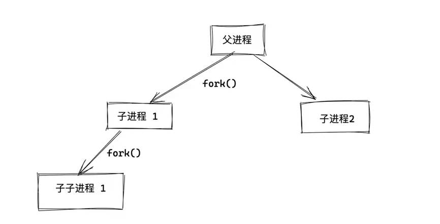

# linux

### 修改 ip

- nmtui工具 修改
- vim /etc/sysconfig/network-scripts/<`ifcfg-`加上网络接口名称命名>
  - `BOOTPROTO=static`：将网络配置设置为静态。
  - `IPADDR=x.x.x.x`：将`x.x.x.x`替换为你想要的静态IP地址。
  - `NETMASK=255.255.255.0`：子网掩码，根据你的网络设置进行修改。
  - `GATEWAY=x.x.x.x`：网关地址，根据你的网络设置进行修改。
  - `DNS1=x.x.x.x`：首选DNS服务器地址，可以添加多个DNS服务器，使用`DNS2=x.x.x.x`、`DNS3=x.x.x.x`等表示。
  - `ONBOOT=yes`：确保在系统启动时启用网络接口。

### linux紧急修护模式

1. 先按 `e` 进入内核编辑模式。
2. 找到 linux 这一行后面，`Ctrl+e` 输入`rd.break`，让系统再次启动进入紧急恢复模式。
3. `Ctrl+x` 保存，进入紧急恢复模式
4. `mount -o remount,rw /sysroot/`
5. `chroot /sysroot`
6. `echo 123 | passwd --stdin root`
7. `touch /.autorelabel` 标记系统在下次启动时，标记SELinux的策略
8. exit
9. reboot


### 权限

在Linux系统中，`rwx` 是用来表示文件或目录权限的三个基本权限，分别对应"读"、"写"和"执行"。以下是每个权限对应的操作：

1. **r（读取）：**
   - 对于文件：允许读取文件的内容。
   - 对于目录：允许列出目录中的文件和子目录。

2. **w（写入）：**
   - 对于文件：允许修改或删除文件的内容，以及创建新文件。
   - 对于目录：允许在目录中创建、删除和重命名文件或子目录。

3. **x（执行）：**
   - 对于文件：允许执行文件，前提是文件对于用户是可执行的。
   - 对于目录：允许进入目录，以便访问目录中的文件或子目录。

这些权限可以分别应用于文件的所有者（owner）、文件所属组（group）和其他用户。权限的组合形成了一个三位的权限字符串，例如 `rwxr-xr--`，其中第一组表示文件所有者的权限，第二组表示文件所属组的权限，第三组表示其他用户的权限。

### 包管理器

#### yum和dnf

- `clean packages`：清楚缓存目录下的软件包，清空的是（/var/cache/yum）下的缓存
- `list`：显示有已经和可以安装的程序包
- `search string` ：根据关键字 string（包名） 查找软件包
- `provides string`：根据关键字 string（命令） 查找软件包
- `history`：列出历史安装命令
  - `undo`：可以删除rpm包以及依赖


#### rpm

- `-qa`: 检查本地已安装的所有软件包
  - `-qa <name> or -q <name>`: 检查本地本地是否拥有 <name> 的软件包，-q 为精确查询，-qa 为模糊查询
- `-ql <name>`：显示已安装的指定软件的文件列表
  - `-qc`：显示配置文件
  - `-qd`：显示已安装软件的 软件包文档 的位置
- `-qf <name>`：查询已安装的指定软件属于哪个安装包
- `-qpi`：查询指定软件包的详细信息
- `--nodesps`：可以在安装，升级或卸载一个软件包时，不检查与其他软件包的依赖关系


### tar

tar -zxvf 

选项

- `c（小）`：创建

- `C（大）`：更改目录为 DIR（-C 后面跟的目录）

- `x`：解压

- `v`：显示压缩过程

- `z`：压缩算法`z`属于gzip压缩

- `j`：压缩算法`j`表示bzip2压缩

- `f`：表示指定压缩文件的名称

  

  

### ls(list)

~~~shell
[root@controller ~]# ls -l
总用量 2590416
-rw-------. 1 root root       1337 12月  4 17:39 anaconda-ks.cfg
-rw-r--r--. 1 root root 2652577792 6月   7 2022 chinaskills_cloud_iaas_v2.0.3.iso
-rw-r--r--  1 root root          0 12月  5 12:12 file
-rw-r--r--  1 root root        102 12月  5 10:30 logininfo.txt
drwxr-xr-x  2 root root          6 12月  6 15:30 ws
~~~

1. **第一列**的字符表示文件或目录的类型和权限，其中第一个字符表示文件类型，例如：
   
   - `-`：表示普通文件
   
   - `d`：表示目录
   
   - `i`：表示符号链接
   
   - `c`：表示字符设备文件
   
   - `b`：表示块设备文件
   
   - `s`：表示套接字文件
   
   - `p`：表示管道文件
2. **第一列**的其余 9 个字符表示文件或目录的访问权限，分别对应三个字符一组的`rwx`权限，例如：
   
   - `r`：表示读取权限，对应数字4
   - `w`：表示写入权限，对应数字2
   - `x`：表示执行权限，对应数字1
   - `-`：表示没有对应权限
   - 前三个字符字符表示`所有者`权限，中间三个为`所属组`权限，后三个字符表示`其他用户`的权限。
3. **第二列**表示链接数，表示有多少个文件链接到 inode 号码。
4. **第三列**表示拥有者
5. **第四列**表示所属组
6. **第五列**表示文档容量大小，单位字节，ls -h 后，以人类可读的方式显示当前目录中的文件和目录大小
7. **第六列**表示文档最后修改时间，注意不是文档的创建时间
8. **第七列**表示文档名称，以点(.)开头的是隐藏文件

   

### 配额

#### Quota 的规范设置项目：

- ext 文件系统系列再进行磁盘配额限制的时候，它仅能针对整个文件系统来进行设计，无法针对某个单一的目录来设计它的磁盘配额。


- xfs 文件系统 可以使用 project 模式来设计不同目录的磁盘配额。

#### 柔性劝导与硬性规定 （soft/hard）

既然是规范，当然就有限制值。不管是 inode/block ，限制值都有两个，分别是 soft 与 hard。 通常 hard 限制值要比 soft 还要高。举例来说，若限制项目为 block ，可以限制 hard 为 500MBytes 而 soft 为 400MBytes。这两个限值的意义为：

- hard：表示使用者的用量绝对不会超过这个限制值，以上面的设置为例， 使用者所能使 用的磁盘容量绝对不会超过 500MBytes ，若超过这个值则系统会锁住该用户的磁盘使用权；

- soft：表示使用者在低于 soft 限值时 （此例中为 400MBytes），可以正常使用磁盘，但 若超过 soft 且低于 hard 的限值 （介于 400~500MBytes 之间时），每次使用者登陆系统 时，系统会主动发出磁盘即将爆满的警告讯息， 且会给予一个宽限时间 （grace time）。不过，若使用者在宽限时间倒数期间就将容量再次降低于 soft 限值之下， 则宽 限时间会停止。

- 会倒数计时的宽限时间 （grace time）：

#### 范例（xfs文件系统）

添加一块20G的磁盘，格式化为 xfs 文件系统。

设置用户 *myquota1,myquota2* 在该分区中使用的最大空间配额为50M。

myquota1,myquota2 用户都在 myquotagrp 这个用户组中，这个用户组最多使用80M的容量，如果我们的 myquota1 使用了50M，那么 myquota2 仅仅只能使用 30M，修改 grace time 为14天，这就是对用户和用户组同时设置时会产生的结果。

- 1、使用脚本建立环境

  ~~~shell
  [root@localhost ~]# vim ws.sh
  #!/bin/bash
  groupadd myquotagrp
  for i in myquota1 myquota2
  do
  	useradd -g myquotagrp $i
  	echo "password" | passwd --stdin $i	
  done
  mkdir /home/myquota
  chgrp myquotagrp /home/myquota
  chmod 2770 /home/myquota
  [root@localhost ~]# sh ws.sh
  ~~~

- 2、文件系统的支持与查看

  ~~~shell
  # 查看磁盘
  [root@localhost ~]# lsblk 
  NAME            MAJ:MIN RM  SIZE RO TYPE MOUNTPOINT
  sda               8:0    0   50G  0 disk 
  ├─sda1            8:1    0    1G  0 part /boot
  └─sda2            8:2    0   49G  0 part 
    ├─centos-root 253:0    0   47G  0 lvm  /
    └─centos-swap 253:1    0    2G  0 lvm  [SWAP]
  sdb               8:16   0   20G  0 disk 			# 添加的磁盘
  sr0              11:0    1  4.4G  0 rom  
  
  # 格式化
  [root@localhost ~]# mkfs.xfs /dev/sdb
  meta-data=/dev/sdb               isize=512    agcount=4, agsize=1310720 blks
           =                       sectsz=512   attr=2, projid32bit=1
           =                       crc=1        finobt=0, sparse=0
  data     =                       bsize=4096   blocks=5242880, imaxpct=25
           =                       sunit=0      swidth=0 blks
  naming   =version 2              bsize=4096   ascii-ci=0 ftype=1
  log      =internal log           bsize=4096   blocks=2560, version=2
           =                       sectsz=512   sunit=0 blks, lazy-count=1
  realtime =none                   extsz=4096   blocks=0, rtextents=0
  
  # 查看文件格式
  [root@localhost ~]# df /dev/sdb  -Th
  # 添加以下一行
  /dev/sdb	/home	xfs	defaults,usrquota,grpquota	0 0		# usrquota：针对用户设置；grpquota：针对用户组的设置；prjquota：针对单一目录的设置，但不可与 grpquota 同时存在。
  
  # 挂载
  mount -a
  ~~~

- 3、XFS quota 的管理指令

  语法格式：xfs_quota -x -c "指令" [挂载点]

  选择与参数：

  -x ：专家模式，后续才能够加入 -c 的指令参数！

  -c ：后面加的就是指令，这个小节我们先来谈谈数据回报的指令

  指令：

  - print ：单纯的列出目前主机内的文件系统参数等数据


  - df ：与原本的 df 一样的功能，可以加上 -b （block） -i （inode） -h （加上单位） 等


  - report：列出目前的 quota 项目，有 -ugr （user/group/project） 及 -bi 等数据


  - state ：说明目前支持 quota 的文件系统的信息，有没有起动相关项目等

    ~~~shell
    # 列出当前系统的各个文件系统，已经是否支持磁盘配额挂载参数
    [root@localhost ~]# xfs_quota -x -c 'print'
    Filesystem          Pathname
    /                   /dev/mapper/centos-root
    /boot               /dev/sda1
    /home/ws            /dev/sdb (uquota, gquota)
    
    # 列出磁盘配额限制值
    [root@localhost ~]# xfs_quota -x -c 'report -ubih' /home
    User quota on /home (/dev/sdb)
                                   Blocks                                          Inodes                     
    User ID          Used       Soft       Hard    Warn/Grace           Used       Soft       Hard    Warn/ Grace     
    ---------- -------------------------------------------------- -------------------------------------------------- 
    root                   0          0          0     00 [--------]          3          0          0     00 [--------]
    
    # 列出磁盘配额限制值
    [root@localhost ~]# xfs_quota -x -c "report -gbih" /home
    Group quota on /home (/dev/sdb)
                            Blocks                            Inodes              
    Group ID     Used   Soft   Hard Warn/Grace     Used   Soft   Hard Warn/Grace  
    ---------- --------------------------------- --------------------------------- 
    root            0      0      0  00 [------]      3      0      0  00 [------]
    
    
    # 列出当前 /home 这个支持磁盘配额的挂载点文件系统使用情况
    [root@localhost ~]# xfs_quota -x -c 'df -h' /home/
    Filesystem     Size   Used  Avail Use% Pathname
    /dev/sdb      20.0G  32.2M  20.0G   0% /home
    
    # 列出当前支持的磁盘配额文件系统是否启动了磁盘配额功能
    [root@localhost ~]# xfs_quota -x -c 'state'
    User quota state on /home (/dev/sdb)
      Accounting: ON
      Enforcement: ON
      Inode: #67 (1 blocks, 1 extents)
    Group quota state on /home (/dev/sdb)
      Accounting: ON
      Enforcement: ON
      Inode: #68 (1 blocks, 1 extents)
    Project quota state on /home (/dev/sdb)
      Accounting: OFF
      Enforcement: OFF
      Inode: #68 (1 blocks, 1 extents)
    Blocks grace time: [7 days]
    Inodes grace time: [7 days]
    Realtime Blocks grace time: [7 days]
    
    # 设置用户配额
    [root@localhost ~]# xfs_quota -x -c "limit -u bsoft=40M bhard=50M myquota1" /home
    [root@localhost ~]# xfs_quota -x -c "limit -u bsoft=40M bhard=50M myquota2" /home
    
    # 设置用户组配额
    [root@localhost ~]# xfs_quota -x -c "limit -g bsoft=70M bhard=80M myquotagrp" /home
    
    # 设置 grace time
    xfs_quota -x -c 'timer -g -b 14days' /home
    xfs_quota -x -c 'timer -u -b 14days' /home
    
    # 查询 xfs 文件系统上的配额状态
    [root@localhost ~]# xfs_quota -x -c "state"
    User quota state on /home (/dev/sdb)
      Accounting: ON
      Enforcement: ON
      Inode: #67 (2 blocks, 2 extents)
    Group quota state on /home (/dev/sdb)
      Accounting: ON
      Enforcement: ON
      Inode: #68 (2 blocks, 2 extents)
    Project quota state on /home (/dev/sdb)
      Accounting: OFF
      Enforcement: OFF
      Inode: #68 (2 blocks, 2 extents)
    Blocks grace time: [14 days]			# 已修改成14天了
    Inodes grace time: [7 days]
    Realtime Blocks grace time: [7 days]
    ~~~

    

- 4、project 的限制（针对目录）
  限制 /home/myquota 这个目录

  ~~~shell
  # 因为 group 和 project 只能存在一个，修改 /etc/fatab 启动文件系统的支持
  [root@localhost ~]# vim /etc/fstab 
  #
  # /etc/fstab
  # Created by anaconda on Mon Oct 23 15:59:05 2023
  #
  # Accessible filesystems, by reference, are maintained under '/dev/disk'
  # See man pages fstab(5), findfs(8), mount(8) and/or blkid(8) for more info
  #
  /dev/mapper/centos-root /                       xfs     defaults        0 0
  UUID=fa68fb60-2ab9-4c04-9432-3fae688d1604 /boot                   xfs     defaults        0 0
  /dev/mapper/centos-swap swap                    swap    defaults        0 0
  /dev/sdb	/home/	xfs	defaults,usrquota,prjquota	0 0			# 把 grpquota 修改成 prjquota
  
  # 创建并初始化配额数据库
  mkdir /home/myquota
  echo "11:/home/myquota" >> etc/projects
  echo "ws:11" >> /etc/projid
  xfs_quota -x -c "project -s ws"
  Setting up project ws (path /home/myquota)...
  Processed 1 (/etc/projects and cmdline) paths for project ws with recursion depth infinite (-1).
  Setting up project ws (path /home/myquota)...
  Processed 1 (/etc/projects and cmdline) paths for project ws with recursion depth infinite (-1).
  Setting up project ws (path /home/myquota)...
  Processed 1 (/etc/projects and cmdline) paths for project ws with recursion depth infinite (-1).
  
  # 列出磁盘配额限制值
  [root@localhost ~]# xfs_quota -x -c "report -pbih" /home
  Project quota on /home (/dev/sdb)
                          Blocks                            Inodes              
  Project ID   Used   Soft   Hard Warn/Grace     Used   Soft   Hard Warn/Grace  
  ---------- --------------------------------- --------------------------------- 
  #0              0      0      0  00 [------]      5      0      0  00 [------]
  ws              0      0      0  00 [------]      1      0      0  00 [------]
  
  # 设置目录（project）限制
  [root@localhost ~]# xfs_quota -x -c "limit -p bsoft=450M bhard=500M ws" /home
  
  # 列出磁盘配额限制值
  [root@localhost ~]# xfs_quota -x -c "report -pbih" /home
  Project quota on /home (/dev/sdb)
                          Blocks                            Inodes              
  Project ID   Used   Soft   Hard Warn/Grace     Used   Soft   Hard Warn/Grace  
  ---------- --------------------------------- --------------------------------- 
  #0              0      0      0  00 [------]      5      0      0  00 [------]
  ws              0   450M   500M  00 [------]      1      0      0  00 [------]
  ~~~
  
- 5、删除配额

  ~~~shell
  # 暂时取消XFS文件系统的quota限制功能
  xfs_quota -x -c "disable -up" /hoem
  
  # 启动
  xfs_quota -x -c "enable -up" /home
  
  # 移除XFS文件系统配额：
  # 如果要移除project，off完全关闭配额限制。
  xfs_quota -x -c "off -up" /home
  
  # 如想重开需卸载再重新挂载才能启动，如果无需执行remove，不建议使用off，一般disable即可。
  xfs_quota -x -c "remove -p" /home
  ~~~
  
  

#### 范例（etc文件系统）

openEuler 系统默认的文件系统类型就是 etc4。

~~~shell
EXT4类型的配额：
任何一个条件达到峰值时，都不可以进行创建了。
soft软限制是警告值，hard硬限制是最终实际使用的大小。如果文件没有写满，不会触发时间。对于所有的配额都适用。

首先第一步挂载：
1、挂载的同时需要为文件系统添加支持配额的选项
在/etc/fstab中的defaults后添加usrquota，grpquota等选项。（需要哪个添加哪个即可）
添加以前可以使用mount指令进行查询，mount | grep 对应磁盘分区
执行mount -o remount 挂载路径，在不下线的情况下重新进行挂载。（或者直接将设备下线然后再重新挂载即可。）
然后再次执行mount | grep 对应磁盘分区，进行查看，即可。

2、创建对应的配额文件
指令：quotacheck -augcv 
输入该指令后，会在对应的挂载目录下生成对应的配额文件
-a 扫描所有支持配额的分区
-u 扫描磁盘计算用户所占用的文件数
-g 扫描磁盘计算组所占用的文件数
-c 创建配额文件aquota.user和aquota.group
-v 显示详细信息

3、针对用户或者用户组来进行配额的设置

edquota -u/g 用户/用户组

打开文件后，block文件后的soft为软限制，是一个警示（快达到满额度时的一个警告），hard是硬限制，限制大小的。（自定义大小即可，但不能超过磁盘分区的空间，否则没有意义。警示也是如此，警示不得超过硬限制，否则也是没有意义。）inode后的soft同理也是软限制，限制的是个数，hard是硬限制，限制实际的文件个数。（原理也是同上）

4、配额完成后，进行配额的激活开启
指令：
quotaon -a 开启全部
-a 表示开启支持配额功能所有分区

quotaoff -a 关闭

5、查询相应的配额

针对用户：
quota -u 用户名
针对组：
quota -g 用户组
针对设备：
repquota 设备路径
-s 选项可以显示单位

------------------------------------------------------------------------------
细节注意/etc/fstab文件，不要出现错误，否则磁盘无法挂载，或无法识别对于的配额选项。
如出现大问题会导致系统无法启动。需要进入紧级模式进行检查恢复。
------------------------------------------------------------------------------
————————————————
原文链接：https://blog.csdn.net/rumil/article/details/130163621
~~~


### 系统进程管理

进程是什么？

进程(process)就是已启动的可执行程序（program）的运行实例。

#### 进程组成部分

1. 已分配内存的地址空间；
2. 安全属性，包括所有权凭据和特权；
3. 程序代码的一个或多个执行线程；
4. 进程状态。

程序：二进制文件，静态 /usr/bin/passwd,/usr/sbin/useradd。

进程：是程序运行的过程，动态，有生命周期及运行状态。

#### 进程分类

- 实时进程
  - Typora 用户交互的进程，需要及时响应。
- 普通进程
  - 响应不需要那么及时的进程，压缩文件，视频的编码解码。

#### 上下文切换

上下文切换（context switch）又称环境切换，电脑术语，是一个存储和重建 CPU 的状态，因此令多个进程（process）可以分享单一 CPU 资源的计算过程。要切换 CPU 上的进程时，必须先行存储目前进程的状态，再将欲运行的进程之状态读回 CPU 中。

#### Nice 值

nice 值越高，cpu 调度优先级越低。

- nice 命令

  ~~~shell
  # 启动一个进程并设置 nice 值
  [root@openeuler ~]# nice -n 11 bash
  [root@openeuler ~]#
  [root@openeuler ~]# ps -l
  F S   UID    PID   PPID  C PRI  NI ADDR SZ WCHAN  TTY          TIME CMD
  4 S     0   1068   1061  0  80   0 - 29070 do_wai pts/0    00:00:00 bash
  4 S     0   4244   1068  0  91  11 - 29018 do_wai pts/0    00:00:00 bash
  0 R     0   4257   4244  0  91  11 - 38331 -      pts/0    00:00:00 ps
  [root@openeuler ~]# nice
  11
  ~~~

  

- renice 命令

  ~~~shell
  # 使用命令 renice 修改进程的 nice 值
  # 要将进程 ID 为 1234 的进程的优先级设置为 10，你可以使用以下命令
  renice 10 -p 1234		
  
  # 如果要修改属于特定用户的所有进程的优先级，可以使用以下命令：
  renice 10 -u username
  
  # 查看进程优先级，查看 NI 一列的信息，显示的是进程的 nice 值
  # NI: 进程的nice值。这是一个可以由用户调整的值，用于改变进程的优先级。一个正值的nice值将使进程优先级降低（运行更慢），而负值则使优先级提高（运行更快）
  ps -efl 	# 这个命令提供了比简单的 ps -ef 更详细的信息，包括进程ID（PID）、父进程ID（PPID）、用户ID（UID）、启动时间（STIME）、占用的CPU总时间（TIME）、终端类型（TTY）以及进程的启动命令（CMD）等。
  ~~~


#### 进程 fork 概念

1. 我们系统本身就是一堆进程，当系统运行时，就产生了 0 号进程，其他进程都是由 0 号进程所创建的子进程。

2. linux 启动后，第一个进程就是 PID 为 0，通过 0 号进程 fork（）出其他的进程。

3. 操作系统的运行，就是不断地创建进程，以及销毁进程。

   

~~~shell
# 使用BSD语法查看系统上的每个进程，unix 操作系统下，查看进程，用如下不带短横线的参数选项
[root@openeuler ~]# ps auxf   
...
root        814  0.0  0.2 112900  4348 ?        Ss   Mar01   0:00 /usr/sbin/sshd -D
root       1061  0.0  0.3 163568  6336 ?        Ss   Mar01   0:00  \_ sshd: root@pts/0
root       1068  0.0  0.1 116280  2948 pts/0    Ss   Mar01   0:00  |   \_ -bash
root       4244  0.0  0.1 116204  2840 pts/0    SN   11:20   0:00  |       \_ bash
root       4694  0.0  0.0 155584  1936 pts/0    RN+  15:15   0:00  |           \_ ps -auxf
root       1066  0.0  0.2 163264  6052 ?        Ss   Mar01   0:00  \_ sshd: root@notty
root       1089  0.0  0.1  72252  2676 ?        Ss   Mar01   0:00      \_ /usr/libexec/openssh/sftp-server

# 使用标准语法查看系统上的每个进程
[root@openeuler ~]# ps -ef | grep ssh
root        814      1  0 Mar01 ?        00:00:00 /usr/sbin/sshd -D
root       1061    814  0 Mar01 ?        00:00:00 sshd: root@pts/0
root       1066    814  0 Mar01 ?        00:00:00 sshd: root@notty
root       1089   1066  0 Mar01 ?        00:00:00 /usr/libexec/openssh/sftp-server
root       4728   4244  0 15:28 pts/0    00:00:00 grep --color=auto ssh
~~~

> 小知识：当使用 ps 命令来查看进程名字，带有中括号的成为内核进程，是 linux 内核自动生成的进程，linux 所有的发行版都能看见，不带中括号，就是发行版系统生成的进程，用户来生成各种进程。
>

进程产生执行流程：

~~~
操作系统 0 号进程，0 号进程会创建出一堆内核级进程，提供操作系统运行。
↓
linux 用户级别启动的 1 号进程
↓
创建子进程 sshd 进程
↓
用户 /bin/bash 进程
↓
用户执行其他命令进程
~~~


#### 孤儿进程

1. 程序运行时，生成了父亲进程，儿子进程。
2. 父亲进程突然挂了，儿子成了孤儿，被1号进程收养。
3. 儿子进程的诞生是为了执行程序，程序结束后，被 1 号进程释放，消失在了这个美丽的世界。


#### 僵尸进程

1. 僵尸进程明显比孤儿进程可怕，是有害的
2. 父进程创建出子进程后，如果子进程先挂了，父进程却不知道儿子进程挂了这件事，就无法正确送走儿子进程，没有处理它在系统中的信息，那么这个儿子进程就会变成可怕的僵尸进程，会对系统产生危害。
3. 当系统中有了僵尸进程，你可以通过 ps 命令找到它，并且它的状态是 Z（zombie）。
4. 如果系统中产生大量僵尸进程，占据了系统中大量可分配的资源，如果进程 id 号，系统就无法再正确创建新进程，完成任务，导致系统无法使用的危害。

> 如何解决僵尸进程：1.可以主动杀死（kill）父亲进程 pid；2.如果程序会自动结束的话，比如 timesleep()时间到期。


#### 进程文件资源管理

lsof（list open file）列出当前系统打开文件的工具。

常用参数：

- -c：指定进程名称，打开了哪些系统文件
- -p：显示指定 pid 打开的文件
- -u：显示指定用户 uid 打开的文件，以及具体进程信息
- +d：显示文件夹下被打开的文件有哪些
- +D：递归列出目录下哪些文件被进程打开
- -n：不显示主机名，直接显示 ip
- -P：不显示端口名，直接显示端口号
- -s：列出文件大小

示例：

~~~shell
# 查看占用文件的进程
lsof /usr/sbin/sshd

# 查看指定程序名，打开的文件
lsof -c sshd

# 显示文件夹下被打开的文件有哪些
lsof +d /var/log

# 指定 pid，查看这个进程所使用的文件
lsof -p 811
~~~


#### 结束进程的命令

- 结束指定 pid 的进程

  - kill

    语法：kill [信号] PID

    作用：kill 命令会向操作系统内核发送一个信号（多是终止信号）和目标进程的 PID，然后系统内核根据收到的信号类型，对指定进程进行相应的操作

    ~~~shell
    # 信号：
    [root@openeuler ~]# kill -l
     1) SIGHUP	 2) SIGINT	 3) SIGQUIT	 4) SIGILL	 5) SIGTRAP
     6) SIGABRT	 7) SIGBUS	 8) SIGFPE	 9) SIGKILL	10) SIGUSR1
    11) SIGSEGV	12) SIGUSR2	13) SIGPIPE	14) SIGALRM	15) SIGTERM
    16) SIGSTKFLT	17) SIGCHLD	18) SIGCONT	19) SIGSTOP	20) SIGTSTP
    21) SIGTTIN	22) SIGTTOU	23) SIGURG	24) SIGXCPU	25) SIGXFSZ
    26) SIGVTALRM	27) SIGPROF	28) SIGWINCH	29) SIGIO	30) SIGPWR
    31) SIGSYS	34) SIGRTMIN	35) SIGRTMIN+1	36) SIGRTMIN+2	37) SIGRTMIN+3
    38) SIGRTMIN+4	39) SIGRTMIN+5	40) SIGRTMIN+6	41) SIGRTMIN+7	42) SIGRTMIN+8
    43) SIGRTMIN+9	44) SIGRTMIN+10	45) SIGRTMIN+11	46) SIGRTMIN+12	47) SIGRTMIN+13
    48) SIGRTMIN+14	49) SIGRTMIN+15	50) SIGRTMAX-14	51) SIGRTMAX-13	52) SIGRTMAX-12
    53) SIGRTMAX-11	54) SIGRTMAX-10	55) SIGRTMAX-9	56) SIGRTMAX-8	57) SIGRTMAX-7
    58) SIGRTMAX-6	59) SIGRTMAX-5	60) SIGRTMAX-4	61) SIGRTMAX-3	62) SIGRTMAX-2
    63) SIGRTMAX-1	64) SIGRTMAX	
    ~~~

    常用信号解释：

    - 15) SIGTERM：kill命令，不指定任何信号，默认就是这个信息，告诉程序你可以结束了。
    - 9) SIGKILL：强制性终止，危险的信号。
    - 1) SIGHUP无须关闭进程，重新加载配置文件，如 reload 操作。

- 根据进程名杀死

  - killall
  - pkill

  ~~~shell
  # example
  killall vim
  pkill vim
  ~~~


#### 进程后台运行

命令

- command &：将未启动的 command 放入当前 ssh 的后台去运行，但是当 ssh 会话【异常断开】，后台的进程就会丢失。

- jobs：查看后台进程列表。

- ctrl + z：暂停进程。

- bg：进程放入后台运行，和 & 一样。

- fg：将后台命令放入到前台运行。

- nohup（no hang up）：用于在系统后台不挂断地运行，及时回话异常断开也不会影响程序的运行，真正的将执行的命令放入到后台运行，并且会把日志输入到当前目录中 ./nohup.out 文件中。

  ~~~shell
  nohup ping qq.com &
  ~~~


### 监控命令

#### 1、cpu、磁盘 i/o 指标实践

~~~shell
[root@openEuler ~]# dnf install -y stress
# cpu、磁盘压力测试
[root@openEuler ~]# stress -c 2 -i 2 --timeout 300s &		# 在后台模拟两个CPU核心和两个磁盘I/O线程的压力，持续300秒
~~~


查看 cpu 利用率

1. mpstat

   - -P：显示指定 CPU 的统计信息，如“-P ALL”表示显示所有 CPU 的统计信息，“-p 1，2”表示显示第2路和第3路的 CPU 统计信息。
   - -T：在显示中展示拓扑原色，通常和 -u 结合使用。
   - -o：统计信息以 JSON 的格式展现。

   ~~~shell
   [root@openEuler ~]# mpstat -P ALL 5 2
   Linux 3.10.0-1160.el7.x86_64 (openEuler) 	02/28/2024 	_x86_64_	(2 CPU)
   
   08:13:50 PM  CPU    %usr   %nice    %sys %iowait    %irq   %soft  %steal  %guest  %gnice   %idle
   08:13:55 PM  all   73.50    0.00   26.50    0.00    0.00    0.00    0.00    0.00    0.00    0.00
   08:13:55 PM    0   70.20    0.00   29.80    0.00    0.00    0.00    0.00    0.00    0.00    0.00
   08:13:55 PM    1   76.65    0.00   23.35    0.00    0.00    0.00    0.00    0.00    0.00    0.00
   
   08:13:55 PM  CPU    %usr   %nice    %sys %iowait    %irq   %soft  %steal  %guest  %gnice   %idle
   08:14:00 PM  all   73.23    0.00   26.77    0.00    0.00    0.00    0.00    0.00    0.00    0.00
   08:14:00 PM    0   77.45    0.00   22.55    0.00    0.00    0.00    0.00    0.00    0.00    0.00
   08:14:00 PM    1   69.00    0.00   31.00    0.00    0.00    0.00    0.00    0.00    0.00    0.00
   
   Average:     CPU    %usr   %nice    %sys %iowait    %irq   %soft  %steal  %guest  %gnice   %idle
   Average:     all   73.36    0.00   26.64    0.00    0.00    0.00    0.00    0.00    0.00    0.00
   Average:       0   73.83    0.00   26.17    0.00    0.00    0.00    0.00    0.00    0.00    0.00
   Average:       1   72.83    0.00   27.17    0.00    0.00    0.00    0.00    0.00    0.00    0.00
   ~~~

   

2. ps

   ~~~shell
   [root@openEuler ~]# ps -aux --sort -%cpu | head -n 4		# 列出系统中CPU使用率最高的前四条信息
   USER        PID %CPU %MEM    VSZ   RSS TTY      STAT START   TIME COMMAND
   root       1750 74.2  0.0   7312   100 pts/0    R    20:13   0:47 stress -c 2 -i 2 --timeout 300s
   root       1748 64.8  0.0   7312   100 pts/0    R    20:13   0:41 stress -c 2 -i 2 --timeout 300s
   root       1749 29.5  0.0   7312   100 pts/0    R    20:13   0:18 stress -c 2 -i 2 --timeout 300s
   ~~~

3. htop

4. top

5. glances

查看系统平均负载

~~~shell
[root@openEuler ~]# uptime
 18:58:02 up 16 min,  2 users,  load average: 7.96, 3.12, 1.17
~~~


#### 2、上下文切换指标实践

~~~shell
# 上下文切换压测
sysbench --threads=4 --time=300 threads run &

# 查看系统上下文切换
[root@openEuler ~]# vmstat 3 5		# 每隔3秒钟执行一次命令，执行五秒
procs -----------memory----+------ ---swap-- -----io---- -system-- ------cpu-----
 r  b   swpd   free   buff  cache   si   so    bi    bo   in   cs us sy id wa st
 4  0      0 1532748   2076 300088    0    0     9     4  135  236  3  8 89  0  0
 4  0      0 1532748   2076 300088    0    0     0     0 2010 6480112 16 84  0  0  0
 4  0      0 1532748   2076 300088    0    0     0     0 2015 6246754 17 83  0  0  0
 4  0      0 1532748   2076 300088    0    0     0     0 2010 6369602 17 83  0  0  0
 4  0      0 1532748   2076 300088    0    0     0     0 2009 6584834 16 84  0  0  0
 
[root@openEuler ~]# pidstat -w 5 2 -t | grep sysbench		
# cswch/s：进程每秒主动上下文切换的总数
# 主动上下文切换发生在进程堵塞时，因为进程需要的资源不可用
# nvcswch/s：进程每秒被迫上下文切换的总数
# 进程被迫上下文切换发生在 CPU 时间切换时，强制进程放弃处理器
~~~


#### 3、系统内存指标实践

- 系统内存，工具：free、vmstat
  - 物理内存（memory）
  - 交换系统内存（swap）：当内存不够用时，系统把会硬盘当做内存来使用。
  - 缓冲（buffer）：buffer 是指，写入数据时，把分散的写入操作保存到内存，达到一定程度集中写入硬盘，减少磁盘碎片，以及反复的寻道时间，加速数据写入。
  - 缓存（cache）：cache 是指，把读取磁盘而来的数据存在内存中，再次读取，下次就不用读取硬盘了，而直接从内存中读取，加速数据读取过程。
- 进程内存，工具：top
  - 虚拟内存（VIRT）：需要的虚拟内存
  - 驻留内存（RSE）：实际使用的内存
  - 共享内存（SHR）：与其他进程的共享的内存

示例：

~~~shell
# 物理内存性能压测
stress --vm 2 --vm-bytes 300M --vm-keep --timeout 300s &

# 查看系统虚拟内存
[root@openEuler ~]# vmstat -a -S M 3 5
procs -----------memory---------- ---swap-- -----io---- -system-- ------cpu-----
 r  b   swpd   free  inact active   si   so    bi    bo   in   cs us sy id wa st
 4  0      0    896    106    799    0    0     9     4  160 1303  5  9 86  0  0
 2  0      0    896    106    799    0    0     0     0 2018   97 100  0  0  0  0
 2  0      0    896    106    799    0    0     0     1 2019   88 100  0  0  0  0
 3  0      0    896    106    799    0    0     0    25 2010   83 100  0  0  0  0
 2  0      0    896    106    799    0    0     0     0 2011   81 100  0  0  0  0

# 进程内存压测
sysbench --threads=4 --time=300 threads run --timeout 300s &

# 查看内存进程 top
top -> M
~~~


#### 4、磁盘 i/o 指标实践

磁盘 i/o 主要指标

IOPS（input output per second）：每秒钟磁盘能处理的读写请求数量

吞吐量：每秒磁盘读写的流量


示例：

~~~shell
# 磁盘I/O读写性能压测
[root@openEuler ~]# fio -filename=/data/test.file -direct=1 -iodepth 1 -thread -rw=randrw -rwmixread=70 -ioengine=psync -bs=16k -size=2G -numjobs=10 -runtime=60 -group_reporting -name=test_r_w
~~~


查看

1. sar

   ~~~shell
   sar -d 3 3
   ~~~

   

2. iostat

   ~~~shell
   iostat -dh 3 3 
   ~~~

   

#### 5、网络I/O性能指标实践

网络连接状态：TCP、UDP、HTTP等

响应时间：用户从发出请求到接受完响应之间的总耗时

带宽：单位时间内能传输的数据量


示例：

~~~shell
# 安装网络性能测试工具iperf 
[root@openEuler ~]# dnf install -y iperf

# 查看网络连接状态
[root@openEuler ~]# netstat -antulp
# 常用选项：
# -n：表示不解析服务名称，以端口号的形式呈现给你
# -l：显示监听服务器套接字
# -t：表示只列出 tcp 协议的连接
# -u：表示只列出 udp 协议的连接
# -p：表示显示进程 pid 和进程名称
Active Internet connections (servers and established)
Proto Recv-Q Send-Q Local Address           Foreign Address         State       PID/Program name    
tcp        0      0 0.0.0.0:22              0.0.0.0:*               LISTEN      816/sshd            
tcp        0      0 127.0.0.1:25            0.0.0.0:*               LISTEN      911/master          
tcp        0      0 192.168.113.31:57826    210.44.151.62:80        TIME_WAIT   -                   
tcp        0      0 192.168.113.31:57828    210.44.151.62:80        TIME_WAIT   -                   
tcp        0      0 192.168.113.31:48710    103.77.111.8:443        TIME_WAIT   -                   
tcp        0      0 192.168.113.31:36640    222.139.215.198:443     TIME_WAIT   -                   
tcp        0     36 192.168.113.31:22       192.168.113.1:60417     ESTABLISHED 2191/sshd: root@pts 
tcp        0      0 192.168.113.31:33214    59.69.128.21:443        TIME_WAIT   -                   
tcp        0      0 192.168.113.31:50514    101.6.15.130:443        TIME_WAIT   -                   


# 查看网络响应时间
[root@openEuler ~]# ping www.baidu.com -c 3
PING www.baidu.com (220.181.38.150) 56(84) bytes of data.
64 bytes from 220.181.38.150 (220.181.38.150): icmp_seq=1 ttl=128 time=24.9 ms
64 bytes from 220.181.38.150 (220.181.38.150): icmp_seq=2 ttl=128 time=24.5 ms
64 bytes from 220.181.38.150 (220.181.38.150): icmp_seq=3 ttl=128 time=24.6 ms

--- www.baidu.com ping statistics ---
3 packets transmitted, 3 received, 0% packet loss, time 2003ms
rtt min/avg/max/mdev = 24.552/24.699/24.932/0.210 ms

# 查看网络带宽，iperf可以报告带宽、延迟抖动和数据包丢失，是排查网络问题、定位网络瓶颈的重要工具。
# 1.服务器开启服务
# 登录内网下任意一台ECS用作Server
[root@Server ~]# iperf -s		# —S,--server：开启 Server 模式
-----------------------------------------------------------
Server listening on 5201 (test #1)
-----------------------------------------------------------

# 2.客户端测试内网带宽
[root@openEuler ~]# iperf -c 192.168.113.128 -t 20 -i 5		# -c，--client <host>：开启 Client 模式，连接到指定主机；-t，指定测试的时间；-i：指定吞吐量报告的时间间隔
------------------------------------------------------------
Client connecting to 192.168.113.128, TCP port 5001
TCP window size: 1.14 MByte (default)
------------------------------------------------------------
[  3] local 192.168.113.31 port 39442 connected with 192.168.113.128 port 5001
[ ID] Interval       Transfer     Bandwidth
[  3]  0.0- 5.0 sec  3.60 GBytes  6.18 Gbits/sec
[  3]  5.0-10.0 sec  3.79 GBytes  6.50 Gbits/sec
[  3] 10.0-15.0 sec  3.75 GBytes  6.45 Gbits/sec
[  3] 15.0-20.0 sec  3.78 GBytes  6.49 Gbits/sec
[  3]  0.0-20.0 sec  14.9 GBytes  6.40 Gbits/sec


# 查看网络接口的吞吐量
[root@ansible yum.repos.d]# sar -n DEV 2 1
Linux 3.10.0-1160.el7.x86_64 (ansible) 	02/28/2024 	_x86_64_	(2 CPU)

11:40:11 PM     IFACE   rxpck/s   txpck/s    rxkB/s    txkB/s   rxcmp/s   txcmp/s  rxmcst/s
11:40:13 PM        lo      0.00      0.00      0.00      0.00      0.00      0.00      0.00
11:40:13 PM     ens33  12663.50 570179.50    816.38 1633307.83      0.00      0.00      0.00

Average:        IFACE   rxpck/s   txpck/s    rxkB/s    txkB/s   rxcmp/s   txcmp/s  rxmcst/s
Average:           lo      0.00      0.00      0.00      0.00      0.00      0.00      0.00
Average:        ens33  12663.50 570179.50    816.38 1633307.83      0.00      0.00      0.00
~~~


### linux 数据流

执行linux命令时，linux默认为用户进程提供了 3 种数据流。

- stdin
  - 标准输入，0
  - 一般是键盘输入数据
  - 比如 cat 命令等待用户输入
- stdout
  - 标准输出，1
  - 程序执行结果，输出到终端
- stderr
  - 标准错误输出
  - 程序执行结果，输出到终端


示例：

~~~shell
# stdin 标准输入
[root@openeuler ~]# cat < /etc/passwd
root:x:0:0:root:/root:/bin/bash
bin:x:1:1:bin:/bin:/sbin/nologin
daemon:x:2:2:daemon:/sbin:/sbin/nologin
adm:x:3:4:adm:/var/adm:/sbin/nologin
lp:x:4:7:lp:/var/spool/lpd:/sbin/nologin
sync:x:5:0:sync:/sbin:/bin/sync
shutdown:x:6:0:shutdown:/sbin:/sbin/shutdown
halt:x:7:0:halt:/sbin:/sbin/halt
mail:x:8:12:mail:/var/spool/mail:/sbin/nologin
operator:x:11:0:operator:/root:/sbin/nologin
games:x:12:100:games:/usr/games:/sbin/nologin
ftp:x:14:50:FTP User:/var/ftp:/sbin/nologin
nobody:x:99:99:Nobody:/:/sbin/nologin
systemd-network:x:192:192:systemd Network Management:/:/sbin/nologin
dbus:x:81:81:System message bus:/:/sbin/nologin
polkitd:x:999:998:User for polkitd:/:/sbin/nologin
sshd:x:74:74:Privilege-separated SSH:/var/empty/sshd:/sbin/nologin
postfix:x:89:89::/var/spool/postfix:/sbin/nologin
ws:x:1000:1000::/home/ws:/bin/bash
test:x:1001:1001::/home/test:/bin/bash

# stdout 标准输出
[root@openeuler ~]# ll > 1.txt

# stderr 错误输出
[root@openeuler ~]# ls /wljdlakd > 1.txt 2>&1		# 将错误输出的报错信息，不让在终端中显示，让变成标准输出，再写入到 1.txt 文件中
~~~


### 虚拟机 proxy 流量代理

#### 方法一：proxychnia 

安装 proxychnia 工具，实现代理；我当前使用的是 centos 7，不同的系统版本，安装不同的软件，百度自行查看。

~~~shell
yum install -y proxychains-ng
~~~


修改配置文件，配置如下：

~~~shell
[root@kolla ~]# vim /etc/proxychains.conf 
# 添加一行配置
[ProxyList]
# add proxy here ...
# meanwile
# defaults set to "tor"

socks5   10.64.150.222  7890		# <协议名称>  <主机名>  <端口号>
~~~


如果想使用代理，就在命令前面输入 `proxychains4 <命令>`，示例如下：

~~~shell
[root@kolla ~]# proxychains4 curl github.com
[proxychains] config file found: /etc/proxychains.conf
[proxychains] preloading /usr/lib64/proxychains-ng/libproxychains4.so
[proxychains] DLL init: proxychains-ng 4.17
[proxychains] Strict chain  ...  10.64.150.222:7890  ...  github.com:80  ...  OK
~~~


#### 方法二：环境变量

使用系统自带的代理，配置如下：

~~~shell
# 在 /etc/profile 中加入三行配置
cat >> /etc/profile << EOF 
export https_proxy=http://10.64.150.195:7890  
export http_proxy=http://10.64.150.195:7890
export all_proxy=socks5://10.64.150.195:7890
EOF
~~~


### crontab 定时任务

守护进程：crond

crontab 命令

- -l：查看当前用户的定时任务
- -e：编辑当前用户的定时任务

定时任务参数说明：

~~~shell
# .---------------- 分钟，取值范围为 0-59
# |  .------------- 小时，取值范围为 0-23
# |  |  .---------- 日，取值范围为 1-31
# |  |  |  .------- 月，取值范围为 1-12
# |  |  |  |  .---- 星期，取值范围为 0-7，0 和 7 都表示星期日
# |  |  |  |  |      .-- 要执行的命令
# |  |  |  |  |      |
~~~


### linux 登录界面配置

~~~shell
[root@controller ~]# vim /etc/motd


                        　　 へ　　　　　／|
                        　　/＼7　　　 ∠＿/
                        　 /　│　　 ／　／
                        　│　Z ＿,＜　／　　 /`ヽ
                        　│　　　　　ヽ　　 /　　〉
                        　 Y　　　　　`　 /　　/
                        　●　　●　　〈　　/
                        　()　 へ　　　　|　＼〈
                        　　> _　 ィ　 │ ／／
                        　 / へ　　 /　＜| ＼＼
                        　 ヽ_　　(_／　 │／／
                        　　7　　　　　　　|／
                        　　＞―r￣￣`―＿


                           biubui~biubui~biubui~

~~~


### chattr 命令详解

chattr 命令用于改变文件属性。

命令格式

~~~shell
chattr [-RVf] [-+=aAcCdDeijsStTu] [-v version] files...
~~~

主要参数说明

- -R：递归处理。
- -v <版本编号>：设置文件或目录版本。
- -V：显示指令执行过程。
- +<属性>：在原有参数的基础上，追加参数。
- -<属性>：在原有参数的基础上，删除参数。
- [+-]A：即 Atime，告诉系统不要修改对这个文件的最后访问时间
- [+-]a：即 Append only，系统只允许在这个文件之后追加数据，不允许任何进程覆盖或截断这个文件。如果这个目录具有这个属性，系统将只允许在这个目录下建立和修改文件，而不允许删除任何文件。
- [+-]i：即 Immutable，系统不允许对这个文件进行任何的修改。如果目录具有这个属性，那么任何的进程只能修改目录之下的文件，不允许建立和删除文件

示例演示：

~~~shell
[root@openeuler ~]# touch test
[root@openeuler ~]# chattr +i -V test
chattr 1.42.9 (28-Dec-2013)
Flags of test set as ----i-----------
[root@openeuler ~]# lsattr test
----i----------- test
[root@openeuler ~]# rm -rf test
rm: cannot remove ‘test’: Operation not permitted
~~~

> 一般的，所有的日志文件都可以使用 `chatter +a <logfile>` ，加固系统的安全。


### strace 命令详解

strace 命令在 Linux 系统中用于监视和跟踪进程执行期间的系统调用和信号。

常用参数：

1. -c
    统计每一系统调用的所执行的时间、次数和出错的次数等。这对于分析程序性能瓶颈和错误发生频率非常有用。
2. -d
    输出 strace 关于标准错误的调试信息。这有助于诊断 strace 本身可能遇到的问题。
3. -e trace=set
    指定要跟踪的事件集合。例如，trace=file 表示只跟踪与文件操作相关的系统调用。可以通过逗号分隔多个事件来同时跟踪多种类型的系统调用。
4. -f
    跟踪由 fork 调用所产生的子进程。这样可以看到父进程和所有子进程的系统调用。
5. -F
    尝试跟踪 vfork 调用。在 -f 选项使用时，vfork 默认不被跟踪。
6. -h
    输出简要的帮助信息，列出可用的选项和它们的简短描述。
7. -i
    输出系统调用的入口指针。这通常用于调试和性能分析。
8. -o filename
    将 strace 的输出写入指定的文件，而不是打印到标准错误。这对于保存大量输出或将其与其他工具结合使用非常有用。
9. -p pid
    指定要跟踪的进程的进程 ID（PID）。可以重复多次 -p 选项来同时跟踪多个进程。
10. -q
    禁止输出关于脱离的消息。这有助于减少不必要的输出。
11. -r
    打印出相对时间关于每个系统调用。这有助于理解系统调用的执行顺序和持续时间。
12. -s len
    当系统调用的某个参数是字符串时，最多输出指定长度的内容。默认是 32 个字节。
13. -t
    在输出中的每一行前加上时间信息。这对于分析程序执行的时间线非常有用。
14. -tt
    在输出中的每一行前加上时间信息，以微秒级显示。
15. -T
    显示每个系统调用所花费的时间。这对于性能分析非常有用。

示例：

以下是一个 `strace` 的示例命令，它跟踪 PID 为 23489 的进程，并将输出写入 `/data/log/strace.log` 文件，同时显示每个系统调用的相对时间和所花费的时间：

```bash
strace -tt -T -v -f -o /data/log/strace.log -p 23489
```

这个命令会输出 PID 为 23489 的进程及其子进程的所有系统调用，同时显示每个调用的相对时间和所花费的时间，并将输出保存到 `/data/log/strace.log` 文件中。


### ausearch 和 auditctl 命令

`auditctl`命令主要用于控制内核的审计系统。通过`auditctl`，用户可以对审计规则进行管理，包括获取当前审计系统的状态、添加或删除审计规则等。例如，可以使用`auditctl`命令来启动或停止内核审计功能，添加文件系统对象的监视，设置文件权限，设置审核规则上的过滤关键词等。这使得`auditctl`成为了一个非常重要的工具，可以帮助系统管理员根据需要配置和调整审计系统的行为。

相比之下，`ausearch`命令则主要用于检索审计记录。`ausearch`命令会基于审计文件（通常是`/var/log/audit/audit.log`）进行信息检索，能够根据不同的事件或条件来检索日志。例如，可以根据文件名、命令行、用户ID、进程ID等来搜索审计记录。这使得`ausearch`成为了一个强大的工具，可以帮助系统管理员和运维人员快速查找和分析特定事件或条件下的审计记录，从而更好地了解系统运行情况和发现潜在的安全问题。

因此，可以说`auditctl`和`ausearch`命令在Linux审计系统中各自扮演着不同的角色。`auditctl`主要负责审计规则的管理和控制，而`ausearch`则主要负责审计记录的检索和分析。两者共同协作，使得Linux审计系统能够更加灵活和有效地满足各种安全需求。


### iptables 防火墙

#### iptables 是什么

iptables 是一个用于配置 linux 内核中 IPv4 数据包过滤器和网络地址转换（NAT）的工具。它允许系统管理员根据特定的规则集控制进出的网络流量。iptables 提供了一种灵活而强大的方式来保护网络安全，实现网络地址转换，限制流量等。

#### iptables 工作原理

iptables 是基于 linux 内核中的 Netfilter 架构实现的。当数据包进入或离开系统时，Netfilter 框架会将数据包转递给 iptables 进行处理。它可以通过检查数据包的源地址，目标地址，协议类型，端口号等信息，并根据预定义的规则集来决定如何处理该数据包。

#### iptables 的基本概念

##### 表（Table）

表定义了特定类型的规则集。iptables 提供了四个表：filter、nat、mangle 和 raw。每个表用于不同的目的，如过滤数据包、网络地址转换等。

##### 链（Chain）

链是规则的集合，用于确定数据包在系统中的处理路径，iptables 包含几个预定义的链，如 INPUT，OUTPUT 和 FORWARD。每个链都有特定的处理方式和默认策略。

##### 规则（Rule）

规则则是定义在链中的指令，用于决定数据包的处理方式。规则由匹配条件和动作组成，当数据包满足条件时，将执行相应的动作。

#### 常见的 iptables 命令

基本语法：

~~~shell
use: iptabls [选项] <链名> <规则>
~~~

##### 匹配条件

- `-A`：追加到链上
- `-p`：指定数据包的协议类型，如 TCP、UDP、ICMP 等。
- `-s`：指定数据包的源地址。
- `-d`：指定数据包的目标地址。
- `-i`：指定数据包进入系统的网络接口。
- `-o`：指定数据包离开系统的网络接口。

##### 匹配选项
- `--sport`：指定数据包的源端口。
- `--dport`：指定数据包的目标端口。
- `--state`：指定数据包的连接状态，如 NEW、ESTABLISHED、RELATED 等。
- `--mac-source`：指定数据包的源 MAC 地址。
- `--mac-destination`：指定数据包的目标 MAC 地址。
##### 匹配动作
- `-j`：指定匹配成功时要执行的动作，如 ACCEPT、DROP、REJECT 等。

#### 示例演示

使用 ip:192.168.113.13 的主机1 ping 本机2:192.168.113.11，我们创建两条规则。

~~~shell
# 没创建规则前，如果要模拟，最好清理一下所有规则，iptables -F
# 主机1 ping 主机2
[root@Euler03 ~]# ping 192.168.113.11 -c 2
PING 192.168.113.11 (192.168.113.11) 56(84) bytes of data.
64 bytes from 192.168.113.11: icmp_seq=1 ttl=64 time=0.176 ms
64 bytes from 192.168.113.11: icmp_seq=2 ttl=64 time=0.320 ms
--- 192.168.113.11 ping statistics ---
2 packets transmitted, 2 received, 0% packet loss, time 1024ms
rtt min/avg/max/mdev = 0.176/0.248/0.320/0.072 ms

# 设置第一条规则
iptables --table filter -A INPUT --source 192.168.113.13 -j REJECT

# 主机1 ping 主机2
[root@Euler03 ~]# ping 192.168.113.11 -c 2
PING 192.168.113.11 (192.168.113.11) 56(84) bytes of data.
From 192.168.113.11 icmp_seq=1 Destination Port Unreachable
From 192.168.113.11 icmp_seq=2 Destination Port Unreachable
2 packets transmitted, 0 received, +2 errors, 100% packet loss, time 30663ms

# 设置第二条规则
iptables --table filter -A INPUT --source 192.168.113.13 -j DROP	# 因为 iptables 规则执行顺序，要删除第一条规则

# 查看
iptables --table filter --list INPUT --line-numbers

# 删除第一条规则，此时第二条规则会瞬移到第一条规则
iptables --table filter --delete INPUT 1

# 主机1 ping 主机2
[root@Euler03 ~]# ping 192.168.113.11 -c 2
PING 192.168.113.11 (192.168.113.11) 56(84) bytes of data.

--- 192.168.113.11 ping statistics ---
2 packets transmitted, 0 received, 100% packet loss, time 1024ms
~~~


> 注意：iptables 规则是从上往下读的，当规则1 和规则2 的源地址或目的地址一致，会优先执行规则 1。
>

#### 常见的 ipset 命令

提供下载的国家IP块分配：[IPdeny IP country blocks](https://www.ipdeny.com/)

~~~shell
# 创建名称为test的IP集
ipset create test hash:ip

# 添加地址合集到test IP集中
#! /bin/bash

wget https://www.ipdeny.com/ipblocks/data/aggregated/in-aggregated.zone
for i in `ls in-aggregated.zone`
do
	ipset add test $i
done

if [ $? -eq 0 ]
then 
	echo "*****命令执行完成*****"
else
	echo "*****命令执行失败*****"
fi
~~~

如果想使用 iptables 做规则，可以使用以下命令：

~~~shell
iptables -t filter -A INPUT --match set --match-set test src -j ROP		# 这样印度的 ip 就不能访问到你的电脑了，同时你的电脑也不能访问印度的 ip 了，因为数据包的发送时需要有接受的，虽然你请求了，但是你的电脑做了规则限制，你的电脑就接受不了这个请求包。
~~~


#### iptables 保存配置

因为 iptbales 和 ipset 重启电脑之后之前写的规则都会丢失，所有要保存重启前的规则。

使用命令 `iptables-save` 和 `ipset save` 来保存规则

~~~shell
ipset save > /etc/rulers.ipset

iptables-save > /etc/ruler.iptables
~~~

使用命令 `iptables-restore ` 和 `ipset restore` 导入规则

~~~shell
ipset restore < /etc/ruler.ipset

iptables-restore < /etc/ruler.iptables
~~~


### systemd 

systemd是Linux操作系统的系统和服务管理器。当它作为引导时的第一个进程(作为PID 1)运行时，它充当启动和维护用户空间服务的初始化系统。

Systemd提供了12种不同类型的称为 `units`（单元）的各种实体之间的依赖系统。
单元封装了与系统启动和维护相关的各种对象。
大多数单元都是在单元配置文件中配置的，其语法和基本选项集在system.unit(5)中描述，但是有些是从其他配置自动创建的，动态地从系统状态或在运行时以编程方式创建的。


常用的 units 有：

1. Service units：它可以启动和控制守护进程及其组成的进程。
2. Socket units：套接字单元，封装了本地IPC或网络套接字系统，用于基于套接字的激活。
3. Target units：主要作用在于模拟实现“运行级别”的概念，即它们代表了一种系统状态或一组相关服务的集合。
4. Timer units：主要用于实现定时任务。


### git

#### 命令

git 用法

~~~shell
usage: git [--version] [--help] [-c name=value]
           [--exec-path[=<path>]] [--html-path] [--man-path] [--info-path]
           [-p|--paginate|--no-pager] [--no-replace-objects] [--bare]
           [--git-dir=<path>] [--work-tree=<path>] [--namespace=<name>]
           <command> [<args>]
~~~

常用参数：

- remote：管理跟踪的存储库集

- clone: 拷贝 gitee/github 仓库。

- init：创建一个空的Git存储库或重新初始化一个现有的Git存储库。

- add：将文件内容添加到索引。

- rm：从工作树和索引中删除文件。

- commit：记录对存储库的更改。

- pull：从另一个存储库或本地分支获取并与之集成/更新库。

- push：推送分支内容（指定，默认为当前分支）到远程仓库。

- log：显示提交日志，还可以看见是谁提交的。

- branch：列出，创建或者删除分支。

- checkout：切换到别的分支。

- merge：两个或多个发展历史的结合。

- fetch：将远程主机的最新内容拉到本地，用户在检查了以后决定是否合并到工作本机分支中。

- config：命令配置 git 的配置文件。

- status: 列出所有已修改但尚未暂存（staged）的文件，以及所有已暂存但尚未提交的文件。

- switch：创建并进入该分支。

  

#### 代理

代理的方法有两情况：

1. 使用 http 或 https 协议连接
2. 使用 SSH 协议连接

##### 一、使用 http 或 https 协议连接

windows 和 linux 一样。

~~~shell
# HTTP/HTTPS 协议，port 需与代理软件设置的一致
git config –-global http.proxy http://127.0.0.1:port  # 注意修改 port
# SOCKS5 协议，port 需与代理软件设置的一致
git config --global http.proxy socks5://127.0.0.1:port  # 注意修改 port

# 查看 HTTP/HTTPS 协议代理
git config --global --get http.proxy
# 查看 SOCKS5 协议代理
git config --global --get https.proxy

# 取消代理
git config --global --unset http.proxy
git config --global --unset https.proxy

# 这里就不多说了，说了那么多，我们无非就是修改了 2 个文件，即 ~/.gitconfig 和 ~/.ssh/config ，删除或注释我们增加的相应内容（在相应行的开头加上 # 即可）即可完成取消代理。
~~~


> 注意：
>
> - `--glboal` 选项指的是修改 Git 的全局配置文件`~/.gitconfig`，而非各个 Git 仓库里的配置文件`.git/config`。
> - `port`则为端口号。


##### 二、使用 SSH 协议连接

###### Linux（OpenBSD 版 netcat）和 macOS 用户

```shell
vim ~/.ssh/config
Host github.com
    User git
    ProxyCommand nc -X connect -x 127.0.0.1:7890 %h %p
```


###### Windows 用户

~~~powershell
vim ~/.ssh/config
Host github.com
    User git
    ProxyCommand connect -H 127.0.0.1:7890 %h %p
~~~


参考文档：

[一文让你了解如何为 Git 设置代理 - Eric (ericclose.github.io)](https://ericclose.github.io/git-proxy-config.html#针对所有域名的-Git-仓库)


### ssh

众所周知 SSH 是一种加密的通信方式，但是你知道它是什么吗？你在输入密码的时候确定不会别人窃听到密码吗？

接下来就让我们谈谈 SSH 是怎么为我们保驾护航的。

ssh 握手过程

1. ~~在使用 ssh 命令以后，tcp 会三次握手，然后就会发生 ssh 握手。~~
2. ~~首先双方要交换协议版本，因为 ssh1.0 和 ssh2.0，加密方式不同，两者不兼容。~~
3. ~~接着密钥加密初始化（Key Exchange Initialization），就是双方应该选择哪一种算法，来得到那个不为人知的密钥。~~
4. ~~接着客户端会生成客户端临时密钥，这个密钥是用来后续生成共享安全密钥用的，客户端把临时公钥传递给服务端。~~
5. ~~服务端在收到客户端临时公钥后，也会生成服务端临时公钥和私钥，并会把`客户端临时公钥`和`服务端私钥`和`服务端公钥`合起来~~

接下来最难，听不懂了~~~


