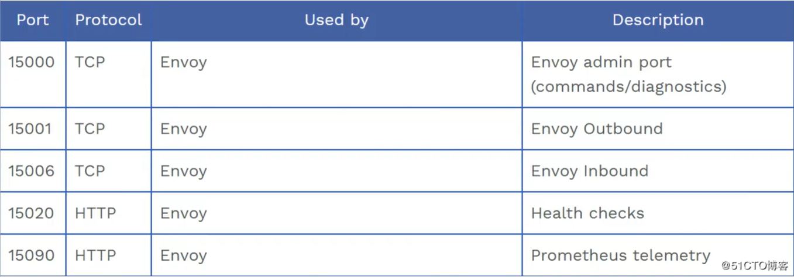
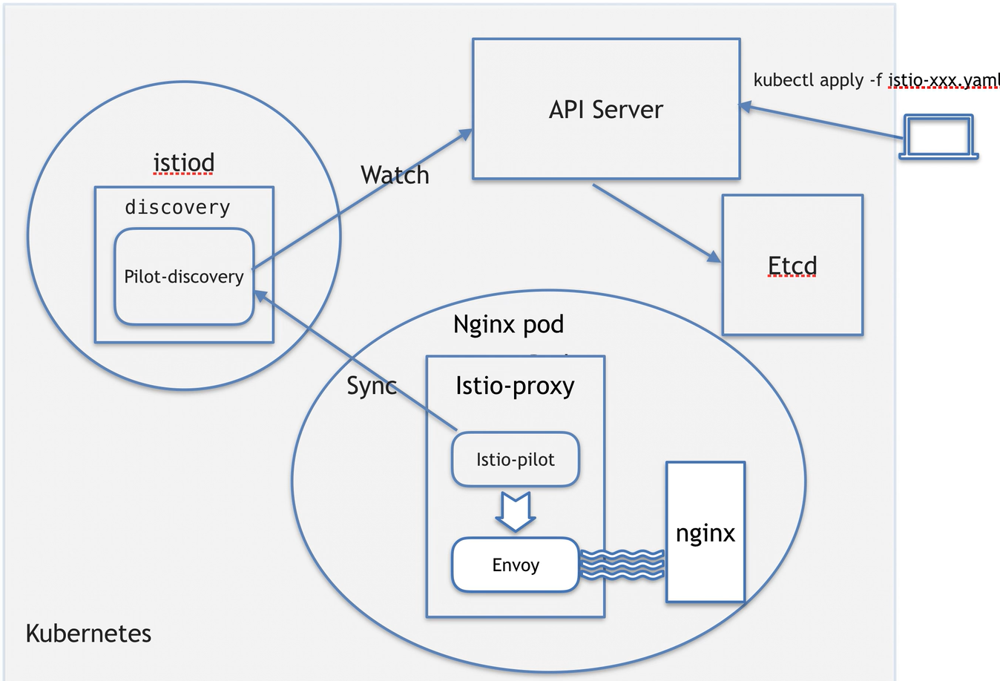

# 服务网格

服务网格（Service Mesh）是一种专门用于处理服务间通信的基础设施层，在微服务架构中起着关键作用。

为什么使用服务网格，我们用kubernetes部署微服务，仍然能够很好的提供服务，为什么还要需要它？

服务网格的特点

- 轻量级的网络感知
- 应用无感知
- 应用之间流量由服务网格接管
- 服务间的调用可能出现的超时、重试、监控、追踪等工作下沉到服务网格层处理。

服务网格（service mesh）是一个专用的基础架构层，`用于管理分布式应用程序中各个微服务之间的通信`。

说到底服务网格就是主要解决微服务架构里面微服务和微服务之间通信的问题

那服务网格到底是怎么做到的呢？


## Istio

Istio是一个服务网格平台，通过在网络中部署轻量级的网络代理（Envoy），实现服务之间的通信管理。Istio的官方定义是：“An open platform to connect, secure, control and observe services.” 即Istio用于连接、保护、控制和观察服务。

官方文档：[Istio / 入门](https://istio.io/latest/zh/docs/setup/getting-started/)


### 安装 istio

- 下载

  1. 转到 [Istio 发布](https://github.com/istio/istio/releases/tag/1.22.1) 页面，下载针对您操作系统的安装文件， 或用自动化工具下载并提取最新版本（Linux 或 macOS）：

  ```shell
  curl -L https://istio.io/downloadIstio | sh -
  ```

  2. 转到 Istio 包目录。例如，如果包是 `istio-1.22.1`：

  ```shell
  cd istio-1.22.1	
  ```

  安装目录包含：

  - samples/：示例应用程序
  - bin/：istioctl 客户端二进制文件

  3. 将 istioctl 客户端添加到环境变量中：

     ~~~shell
     export PATH=$PWD/bin:$PATH
     ~~~

     

- 安装

  1. 对于本次安装，我们采用 `demo` [配置组合](https://istio.io/latest/zh/docs/setup/additional-setup/config-profiles/)。 选择它是因为它包含了一组专为测试准备的功能集合，另外还有用于生产或性能测试的配置组合
  
     ~~~shell
     istioctl install --set profile=demo -y
     ~~~
  
     
  
  2. 自动注入 Envoy 边车代理：
  
     ~~~shell
     kubectl label namespace ws istio-injection=enabled
     namespace/ws labeled
     ~~~
  

### inject 注入

注入之后哪些资源会发生变化？

deployment，daemonset，statefulset，

service，secret，configmap，不会

例如deployment被注入后，deployment会增加两个容器，一个普通容器istio-proxy和一个初始化容器istio-init，istio-init的主要目的是为了创建网络命名空间。

改变了什么？

容器

port



network

进程




## bookinfo 应用


  

  


