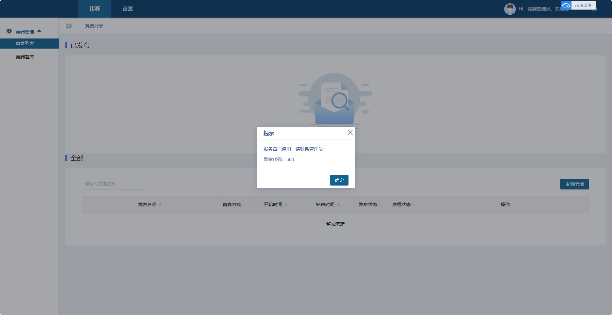

# 竞赛系统

## 系统报错解决

一道云云计算世赛竞赛平台

http://10.47.165.178:7070/#/login

管理员账号

gameoneadmin

密码

jsydy@2023

报错信息：

### 解决过程

竞赛系统是运行的jar包，思路就是先找开启自起的文件，启动了jar包，开启之后，ps -ef 查看进程，发现了一个脚本(/opt/packages/zhixuetong_start_service_all.sh)，里面的内容就是如下：

~~~~shell
#!/bin/bash
echo -e "\033[1;34m 启动discovery-service \033[0m"
sh /opt/service/discovery-service/service.sh start discovery-service-1.5.0.jar

echo -e "\033[1;34m 启动gateway-service \033[0m"
sh /opt/service/gateway-service/service.sh start gateway-service-1.5.0.jar
echo -e "\033[1;34m 等待基础服务启动... \033[0m"
sleep 40

echo -e "\033[1;34m 启动auth-web-api \033[0m"
sh /opt/service/common-auth-service/service.sh start auth-service-1.5.0.jar
sleep 20

echo -e "\033[1;34m 启动game-one-web-api \033[0m"
expect <<-EOF
spawn sh /opt/service/gameone-service/service.sh start game-service-1.5.0-encrypted.jar
expect {
"Password*" {send "XE!A1Mc1V@5SFVA\n";exp_continue}
}
exit
expect eof
EOF
~~~~

等待jar包启动完成，每当启动第四个jar包的时候，都会启动不了，决定前台启动，看看jar包执行的报错信息，

~~~shell
# 这个jar包是经过加密过的，密码就是启动脚本中的"XE!A1Mc1V@5SFVA"
# 前台执行
java -javaagent:game-service-1.5.0-encrypted.jar -jar game-service-1.5.0-encrypted.jar
~~~

前台执行，若不期然出现了报错信息，信息是时间戳有问题，就是时间，然后就修改了时间，2023.09.12 ，修改完成后，再次执行jar包，发现执行好了，从jar包执行的日志发现证书有效期是：2023.09.11~2023.09.15，只要把服务器的时间修改成这个时间段，竞赛系统就能正常使用，结束！！

## BUG

参考文档：[Springboot Actuator未授权访问漏洞复现_poc-yaml-springboot-env-unauth-CSDN博客](https://blog.csdn.net/csdnmmd/article/details/126088188?ops_request_misc=%7B%22request%5Fid%22%3A%22171949116916800186579812%22%2C%22scm%22%3A%2220140713.130102334.pc%5Fblog.%22%7D&request_id=171949116916800186579812&biz_id=0&utm_medium=distribute.pc_search_result.none-task-blog-2~blog~first_rank_ecpm_v1~rank_v31_ecpm-1-126088188-null-null.nonecase&utm_term=spring&spm=1018.2226.3001.4450)

利用 fscan 工具扫描发现漏洞，找到了

[10.47.165.178:10000/actuator/httptrace](http://10.47.165.178:10000/actuator/httptrace)

中的 token（可以登录上管理员） 经过了 jwt 编码。
