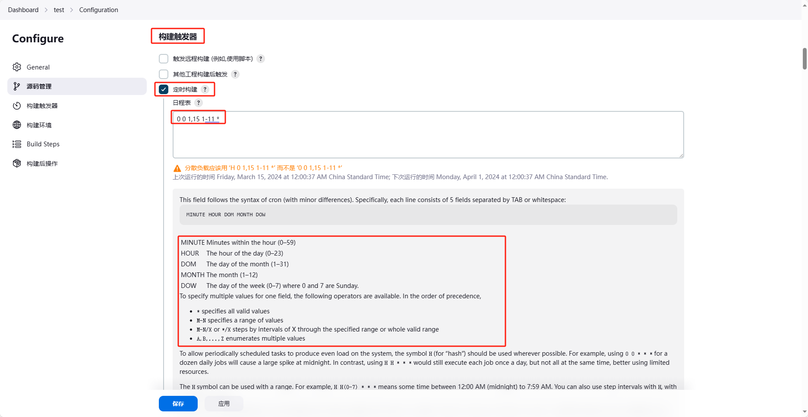
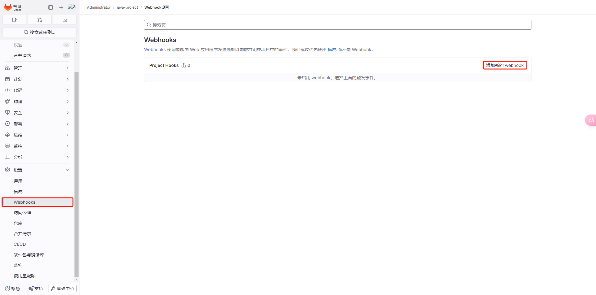
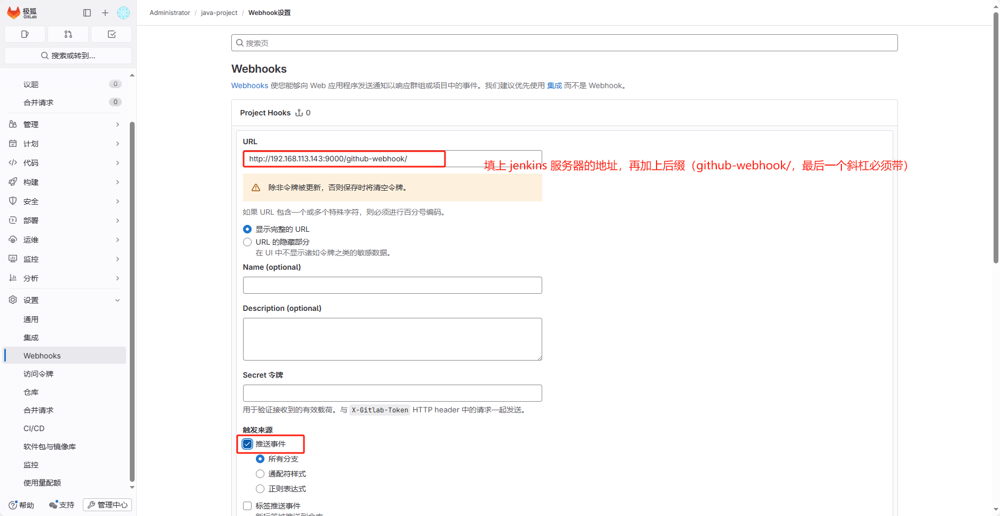
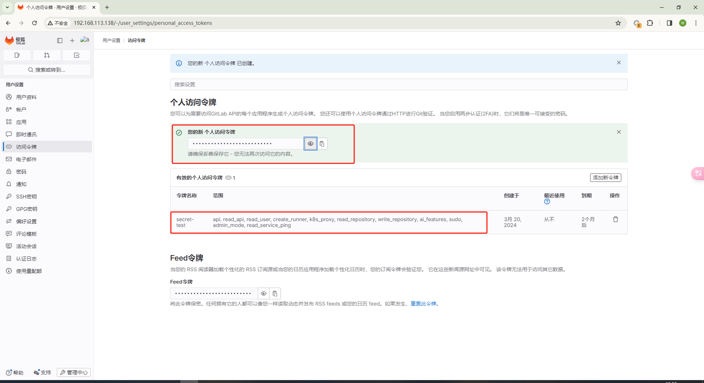

# Jenkins

## Jenkins 是什么？

Jenkins 是一个开源的持续集成（Continuous Integration）工具，用于自动化构建、测试和部署软件项目。它可以帮助开发团队实现代码的持续集成和交付，提高开发效率和软件质量。Jenkins 支持多种编程语言和开发环境，拥有丰富的插件生态系统，可以灵活扩展其功能。通过 Jenkins，开发团队可以定期自动构建项目、运行测试、生成文档、发布应用程序等，从而加快软件开发周期并降低错误率。


## 部署 CI/CD

"CI/CD" 是 "持续集成/持续交付"（Continuous Integration/Continuous Delivery）的缩写。它是一种软件开发实践，旨在通过自动化和持续性的方式来改进软件开发过程。

### gitlab + jenkins + docker

GitLab、Jenkins 和 Docker 是三种常用的软件工具，它们通常结合使用以实现持续集成和持续交付（CI/CD）流程。


#### 安装 gitlab

官方文档：[The most-comprehensive AI-powered DevSecOps platform | GitLab](https://gitlab.com/)

中文官方文档：[GitLab-10万企业使用的一站式DevOps平台_GitLab中文官网](https://gitlab.cn/)

##### 方法一：ssh 安装 gitlab

参考官方文档：[GitLab下载安装_GitLab最新中文官网免费版下载-极狐GitLab](https://gitlab.cn/install/?version=ce)

1. 安装和配置所需的依赖

   在 CentOS 7 上，下面的命令会在系统防火墙中打开 HTTP、HTTPS 和 SSH 访问。这是一个可选步骤，如果您打算仅从本地网络访问极狐GitLab，则可以跳过它。

   ```shell
   sudo yum install -y curl policycoreutils-python openssh-server perl
   sudo systemctl enable sshd
   sudo systemctl start sshd
   sudo firewall-cmd --permanent --add-service=http
   sudo firewall-cmd --permanent --add-service=https
   sudo systemctl reload firewalld
   ```

   

   （可选）如果要使用 Postfix 来发送电子邮件通知，执行以下安装命令。

   ```shell
   sudo yum install postfix
   sudo systemctl enable postfix
   sudo systemctl start postfix
   ```

   

   在安装 Postfix 的过程中可能会出现一个配置界面，在该界面中选择“Internet Site”并按下回车。把“mail name”设置为您服务器的外部 DNS 域名并按下回车。如果还有其他配置界面出现，继续按下回车以接受默认配置。

   如果您想使用其他解决方案发送电子邮件，请跳过上面 Postfix 安装步骤并在安装极狐GitLab 后[配置外部 SMTP 服务器](https://docs.gitlab.cn/omnibus/settings/smtp.html)。

2. 下载并安装极狐GitLab

   执行以下命令配置极狐GitLab 软件源镜像。

   ```shell
   curl -fsSL https://get.gitlab.cn | /bin/bash
   ```

   接下来，安装极狐GitLab。安装之前，需要确保[您的DNS设置正确](https://docs.gitlab.cn/omnibus/settings/dns.html)。此外，还需要通过设置 `EXTERNAL_URL` 环境变量来指定极狐GitLab 实例的 URL。

   如果您想通过 `HTTPS` 来访问实例，那么您可以根据[官方文档](https://docs.gitlab.cn/omnibus/settings/ssl/index.html)进行配置，让实例使用 Let's Encrypt 自动请求 SSL 证书，这需要有效的主机名和入站 HTTP 访问。您也可以使用自己的证书或仅使用 `http://`（不带 `s`）。

   如果您想为初始管理员用户（ `root` ）指定自定义的初始密码，可以根据[文档指导](https://docs.gitlab.cn/omnibus/installation/index.html#设置初始密码)进行配置。否则将默认生成随机密码。

   接下来执行如下命令开始安装：

   ```shell
   sudo EXTERNAL_URL="https://xxx" yum install -y gitlab-jh		# xxx 可以是 ip 也可以是域名
   ```

   其他配置详情可以查看 [Omnibus 安装配置文档](https://docs.gitlab.cn/omnibus/settings)。

3. 登录极狐GitLab 实例

   使用第二步 `EXTERNAL_URL` 中配置的地址来访问安装成功的极狐GitLab 实例。用户名默认为 `root` 。如果在安装过程中指定了初始密码，则用初始密码登录，如果未指定密码，则系统会随机生成一个密码并存储在 `/etc/gitlab/initial_root_password` 文件中， 查看随机密码并使用 `root` 用户名登录。

   注意：出于安全原因，24 小时后，`/etc/gitlab/initial_root_password` 会被第一次 `gitlab-ctl reconfigure` 自动删除，因此若使用随机密码登录，建议安装成功初始登录成功之后，立即修改初始密码。

常用 gitlab-ctl 命令

- gitlab-ctl start：启动所有 gitlab 组件。
- gitlab-ctl stop：停止所有 gitlab 组件。
- gitlab ctl stop porstgresql：停止相关数据连接服务。
- gitlab-ctl restart 重启所有gitlab 组件。
- gitlab-ctl restart xxx：重启 xxx 组件。
- gitlab-ctl status：查看服务状态。

##### 方法二：docker engine 安装 gitlab

参考官方文档：[极狐GitLab Docker 镜像 | 极狐GitLab](https://docs.gitlab.cn/jh/install/docker.html)

对于 Linux 用户，将路径设置为 `/srv/gitlab`：

```shell
export GITLAB_HOME=/srv/gitlab
```


您可以微调这些目录以满足您的要求。 一旦设置了 `GITLAB_HOME` 变量，您就可以运行镜像：

```shell
sudo docker run --detach \
  --hostname gitlab.example.com \
  --publish 443:443 --publish 80:80 --publish 22:22 \
  --name gitlab \
  --restart always \
  --volume $GITLAB_HOME/config:/etc/gitlab \
  --volume $GITLAB_HOME/logs:/var/log/gitlab \
  --volume $GITLAB_HOME/data:/var/opt/gitlab \
  --shm-size 256m \
  registry.gitlab.cn/omnibus/gitlab-jh:latest
```

这将下载并启动极狐GitLab 容器，并发布访问 SSH、HTTP 和 HTTPS 所需的端口。所有极狐GitLab 数据将存储在 `$GITLAB_HOME` 的子目录中。系统重启后，容器将自动 `restart`。


> 不仅可以使用这两种方式使用，还可以使用 kubernetes 中的 helm 包管理软件来安装。
>
> 注：官网文档使用最新 Helm Chart 安装最新版本，如果想要使用其他版本的镜像来部署，可以根据[极狐GitLab Helm Chart 版本查找指南](https://mp.weixin.qq.com/s/ZIHnB8OHbR7ayJkUIg3lXw)来找到对应的 Chart 进行部署。

#### 安装 jenkins

官方文档：[Jenkins](https://www.jenkins.io/)

##### 方法一：ssh 安装 jenkins

参考文档：[开始使用 Jenkins](https://www.jenkins.io/zh/doc/pipeline/tour/getting-started/)

1. [下载 Jenkins](http://mirrors.jenkins.io/war-stable/latest/jenkins.war).
2. 打开终端进入到下载目录.
3. 运行命令 `java -jar jenkins.war --httpPort=8080`.
4. 打开浏览器进入链接 `http://localhost:8080`.
5. 按照说明完成安装.

##### 方法二：docker engine 安装 jenkins

下载 `jenkinsci/blueocean` 镜像并使用以下docker run 命令将其作为Docker中的容器运行 ：

```shell
docker run \ 
  -u root \
  -d \ 
  -p 8080:8080 \ 
  -p 50000:50000 \ 
  -v jenkins-data:/var/jenkins_home \ 
  -v /var/run/docker.sock:/var/run/docker.sock \ 
  jenkinsci/blueocean 
  
  
docker run   -u root   -d   -p 8080:8080   -p 50000:50000   -v jenkins-data:/var/jenkins_home   -v /var/run/docker.sock:/var/run/docker.sock   jenkinsci/blueocean 
```


> 注：如果在容器内无法下载镜像可以选择更换插件下载地址：https://mirrors.tuna.tsinghua.edu.cn/jenkins/updates/update-center.json 
>
> 参考文档：https://blog.csdn.net/G_whang/article/details/131982215


### 构建触发自动化

#### 方法一：定时触发



#### 方法二：webhook 

打开项目仓库设置，打开 webhooks




添加新的 webhook




在 gitlab 上创建 access token




## 流水线（Pipeline）

Groovy 脚本

